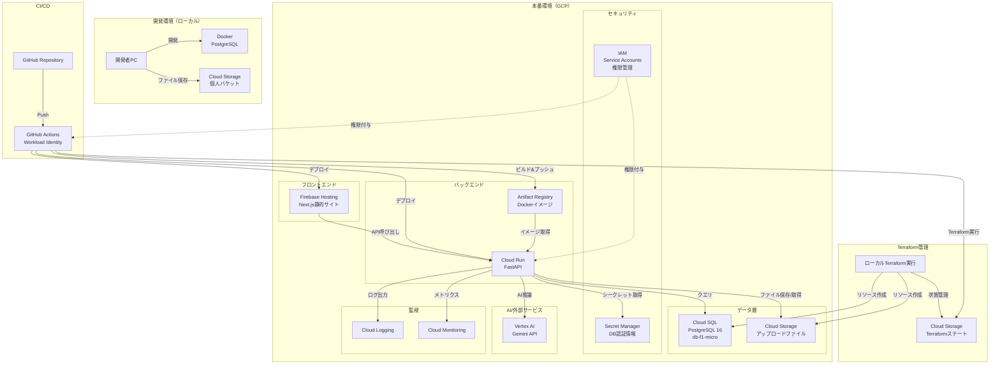

# 設計書

## 概要

本ドキュメントは、GCP上に構築する歴史学習特化型旅行AIエージェントのインフラストラクチャの詳細設計を記述します。Terraformを使用してInfrastructure as Code（IaC）を実現し、開発環境と本番環境の2つの環境を管理します。コスト最適化を重視し、必要最小限のリソース構成とします。

**重要なセキュリティに関する注意事項:**

本プロジェクトは、**プロトタイプ・学習目的**のため、以下のセキュリティ対策を**意図的に実装していません**:

- **VPCネットワーク**: プライベートネットワークを構築せず、Cloud SQLはパブリックIPで公開
- **ファイアウォールルール**: 特定のIPアドレスからのアクセス制限なし
- **Cloud Run認証**: 一般公開（allUsers）でアクセス可能
- **Cloud Armor**: DDoS攻撃対策なし
- **Cloud IAP**: Identity-Aware Proxyによるアクセス制御なし

**この構成は本番運用には適していません。** 機密情報や個人情報を扱う場合は、適切なセキュリティ対策を追加してください。

## アーキテクチャ

### システム全体図



### 環境構成

#### 開発環境（ローカル）
- **アプリケーション**: ローカルで実行（FastAPI + Next.js）
- **データベース**: Docker Compose（PostgreSQL）
- **ストレージ**: Cloud Storage（個人バケット）
- **AI**: Vertex AI（本番と同じ）

#### 本番環境（GCP）
- **フロントエンド**: Firebase Hosting
- **バックエンド**: Cloud Run
- **データベース**: Cloud SQL（PostgreSQL 16、db-f1-micro）
- **ストレージ**: Cloud Storage
- **コンテナレジストリ**: Artifact Registry
- **シークレット管理**: Secret Manager
- **監視**: Cloud Logging + Cloud Monitoring

## コンポーネントと
インターフェース

### 1. Terraformプロジェクト構造

```
infrastructure/
├── terraform/
│   ├── main.tf                 # メインの構成ファイル
│   ├── variables.tf            # 変数定義
│   ├── outputs.tf              # 出力値定義
│   ├── backend.tf              # バックエンド設定（ステート管理）
│   ├── versions.tf             # Terraformとプロバイダーのバージョン指定
│   ├── terraform.tfvars        # 変数値（Git管理対象外）
│   ├── terraform.tfvars.example # 変数値のサンプル
│   │
│   ├── modules/
│   │   ├── cloud-run/          # Cloud Runモジュール
│   │   │   ├── main.tf
│   │   │   ├── variables.tf
│   │   │   └── outputs.tf
│   │   │
│   │   ├── cloud-sql/          # Cloud SQLモジュール
│   │   │   ├── main.tf
│   │   │   ├── variables.tf
│   │   │   └── outputs.tf
│   │   │
│   │   ├── cloud-storage/      # Cloud Storageモジュール
│   │   │   ├── main.tf
│   │   │   ├── variables.tf
│   │   │   └── outputs.tf
│   │   │
│   │   ├── artifact-registry/  # Artifact Registryモジュール
│   │   │   ├── main.tf
│   │   │   ├── variables.tf
│   │   │   └── outputs.tf
│   │   │
│   │   ├── secret-manager/     # Secret Managerモジュール
│   │   │   ├── main.tf
│   │   │   ├── variables.tf
│   │   │   └── outputs.tf
│   │   │
│   │   ├── iam/                # IAMモジュール
│   │   │   ├── main.tf
│   │   │   ├── variables.tf
│   │   │   └── outputs.tf
│   │   │
│   │   └── firebase-hosting/   # Firebase Hostingモジュール
│   │       ├── main.tf
│   │       ├── variables.tf
│   │       └── outputs.tf
│   │
│   └── environments/
│       ├── development-template.tfvars  # 開発環境用テンプレート
│       ├── development-alice.tfvars     # Alice用開発環境（例）
│       ├── development-bob.tfvars       # Bob用開発環境（例）
│       └── production.tfvars            # 本番環境用変数
│
├── docker/                     # ローカル開発用Docker設定
│   └── docker-compose.yml
│
└── docs/
    ├── setup.md                # セットアップ手順
    ├── deployment.md           # デプロイ手順
    └── troubleshooting.md      # トラブルシューティング
```

### 2. Terraform Workspace管理

Terraformのワークスペース機能を使用して環境を分離します。

```hcl
# ワークスペース一覧
# - development: 開発環境（Cloud Storageバケットのみ）
# - production: 本番環境（全リソース）

# ワークスペース名を取得
locals {
  workspace = terraform.workspace
  
  # 環境ごとの設定
  env_config = {
    development = {
      project_id = var.dev_project_id
      region     = "asia-northeast1"
      zone       = "asia-northeast1-a"
    }
    production = {
      project_id = var.prod_project_id
      region     = "asia-northeast1"
      zone       = "asia-northeast1-a"
    }
  }
  
  # 現在のワークスペースの設定
  current_env = local.env_config[local.workspace]
}
```

### 3. Cloud Run（バックエンド）

#### 構成

**セキュリティ強化**: データベースパスワードは、Cloud RunのSecret Manager統合機能を使用して、環境変数に直接埋め込まずにマウントします。これにより、以下のメリットがあります：
- パスワードがログに出力されるリスクを低減
- パスワードローテーション時に再デプロイ不要（`latest`バージョンを使用）

**アプリケーション側の対応**: バックエンドアプリケーションは、以下の環境変数からDATABASE_URLを構築する必要があります：
- `DATABASE_HOST`: Cloud SQLのパブリックIPアドレス
- `DATABASE_NAME`: データベース名
- `DATABASE_USER`: データベースユーザー名
- `DATABASE_PASSWORD`: Secret Managerから取得されたパスワード

```hcl
resource "google_cloud_run_service" "backend" {
  name     = "historical-travel-agent-backend-${local.workspace}"
  location = local.current_env.region
  
  # 本番環境のみ作成
  count = local.workspace == "production" ? 1 : 0
  
  template {
    spec {
      containers {
        image = "${local.current_env.region}-docker.pkg.dev/${local.current_env.project_id}/travel-agent/backend:latest"
        
        # 環境変数
        env {
          name  = "GOOGLE_CLOUD_PROJECT"
          value = local.current_env.project_id
        }
        
        env {
          name  = "GOOGLE_CLOUD_LOCATION"
          value = local.current_env.region
        }
        
        env {
          name  = "STORAGE_TYPE"
          value = "gcs"
        }
        
        env {
          name  = "GCS_BUCKET_NAME"
          value = google_storage_bucket.uploads.name
        }
        
        env {
          name  = "DATABASE_HOST"
          value = google_sql_database_instance.main.public_ip_address
        }
        
        env {
          name  = "DATABASE_NAME"
          value = google_sql_database.main.name
        }
        
        env {
          name  = "DATABASE_USER"
          value = google_sql_user.backend.name
        }
        
        # データベースパスワードをSecret Managerから取得
        env {
          name = "DATABASE_PASSWORD"
          value_from {
            secret_key_ref {
              name = google_secret_manager_secret.db_password.secret_id
              key  = "latest"
            }
          }
        }
        
        # リソース制限
        resources {
          limits = {
            cpu    = "1000m"
            memory = "512Mi"
          }
        }
        
        # ヘルスチェック
        liveness_probe {
          http_get {
            path = "/health"
          }
          initial_delay_seconds = 10
          period_seconds        = 10
        }
      }
      
      # サービスアカウント
      service_account_name = google_service_account.backend.email
      
      # スケーリング設定
      container_concurrency = 80
    }
    
    metadata {
      annotations = {
        "autoscaling.knative.dev/minScale" = "0"
        "autoscaling.knative.dev/maxScale" = "100"
      }
    }
  }
  
  traffic {
    percent         = 100
    latest_revision = true
  }
}

# パブリックアクセス許可（一般公開）
# 注意: 本番運用では認証を追加すべき
resource "google_cloud_run_service_iam_member" "backend_public" {
  count    = local.workspace == "production" ? 1 : 0
  service  = google_cloud_run_service.backend[0].name
  location = google_cloud_run_service.backend[0].location
  role     = "roles/run.invoker"
  member   = "allUsers"
}
```

### 4. Firebase Hosting（フロントエンド）

#### 構成

Firebase Hostingは、Terraformではなく`firebase.json`とFirebase CLIで管理します。

```json
// firebase.json
{
  "hosting": {
    "public": "out",
    "ignore": [
      "firebase.json",
      "**/.*",
      "**/node_modules/**"
    ],
    "rewrites": [
      {
        "source": "/api/**",
        "run": {
          "serviceId": "historical-travel-agent-backend-production",
          "region": "asia-northeast1"
        }
      },
      {
        "source": "**",
        "destination": "/index.html"
      }
    ],
    "headers": [
      {
        "source": "**/*.@(jpg|jpeg|gif|png|svg|webp)",
        "headers": [
          {
            "key": "Cache-Control",
            "value": "public, max-age=31536000, immutable"
          }
        ]
      },
      {
        "source": "**/*.@(js|css)",
        "headers": [
          {
            "key": "Cache-Control",
            "value": "public, max-age=31536000, immutable"
          }
        ]
      }
    ]
  }
}
```

Terraformでは、Firebase Hostingに必要なIAM権限のみ設定します。

```hcl
# Firebase Hosting用のサービスアカウント（GitHub Actionsで使用）
resource "google_service_account" "firebase_deployer" {
  count        = local.workspace == "production" ? 1 : 0
  account_id   = "firebase-deployer"
  display_name = "Firebase Hosting Deployer"
  project      = local.current_env.project_id
}

# Firebase Hosting管理者権限
resource "google_project_iam_member" "firebase_deployer_hosting" {
  count   = local.workspace == "production" ? 1 : 0
  project = local.current_env.project_id
  role    = "roles/firebasehosting.admin"
  member  = "serviceAccount:${google_service_account.firebase_deployer[0].email}"
}
```

### 5. Cloud SQL（PostgreSQL）

#### 構成

```hcl
# Cloud SQLインスタンス
resource "google_sql_database_instance" "main" {
  count            = local.workspace == "production" ? 1 : 0
  name             = "travel-agent-db-${local.workspace}"
  database_version = "POSTGRES_16"
  region           = local.current_env.region
  
  settings {
    tier = "db-f1-micro"  # 最小インスタンス（コスト最適化）
    
    # パブリックIP設定（VPCは使用しない）
    ip_configuration {
      ipv4_enabled = true
      
      # 全IPアドレスからのアクセスを許可（セキュリティリスクあり）
      # 注意: 本番運用では特定のIPアドレスのみ許可すべき
      authorized_networks {
        name  = "allow-all"
        value = "0.0.0.0/0"
      }
      
      # SSL必須
      require_ssl = true
    }
    
    # ディスク設定
    disk_type = "PD_SSD"
    disk_size = 10  # 10GB（最小）
    
    # メンテナンスウィンドウ
    maintenance_window {
      day          = 7  # 日曜日
      hour         = 3  # 午前3時（JST午後12時）
      update_track = "stable"
    }
  }
  
  deletion_protection = true  # 誤削除防止
}

# データベース作成
resource "google_sql_database" "main" {
  count    = local.workspace == "production" ? 1 : 0
  name     = "travel_agent"
  instance = google_sql_database_instance.main[0].name
}

# ユーザー作成
resource "google_sql_user" "backend" {
  count    = local.workspace == "production" ? 1 : 0
  name     = "backend_user"
  instance = google_sql_database_instance.main[0].name
  password = random_password.db_password.result
}

# ランダムパスワード生成
resource "random_password" "db_password" {
  length  = 32
  special = true
}

# パスワードをSecret Managerに保存
resource "google_secret_manager_secret" "db_password" {
  count     = local.workspace == "production" ? 1 : 0
  secret_id = "db-password-${local.workspace}"
  
  replication {
    auto {}
  }
}

resource "google_secret_manager_secret_version" "db_password" {
  count       = local.workspace == "production" ? 1 : 0
  secret      = google_secret_manager_secret.db_password[0].id
  secret_data = random_password.db_password.result
}
```

### 6. Cloud Storage

#### 開発環境用バケット

```hcl
# 開発者個人用バケット
resource "google_storage_bucket" "dev_personal" {
  count    = local.workspace == "development" ? 1 : 0
  name     = "${var.developer_id}-travel-agent-dev"
  location = local.current_env.region
  
  # ライフサイクルルール（30日で自動削除）
  lifecycle_rule {
    condition {
      age = 30
    }
    action {
      type = "Delete"
    }
  }
  
  # 均一なバケットレベルのアクセス
  uniform_bucket_level_access = true
  
  # CORS設定
  cors {
    origin          = ["http://localhost:3000"]
    method          = ["GET", "POST", "PUT", "DELETE"]
    response_header = ["*"]
    max_age_seconds = 3600
  }
}
```

#### 本番環境用バケット

```hcl
# アップロードファイル用バケット
resource "google_storage_bucket" "uploads" {
  count    = local.workspace == "production" ? 1 : 0
  name     = "${local.current_env.project_id}-travel-uploads"
  location = local.current_env.region
  
  # ライフサイクルルール（365日で削除）
  lifecycle_rule {
    condition {
      age = 365
    }
    action {
      type = "Delete"
    }
  }
  
  # 均一なバケットレベルのアクセス
  uniform_bucket_level_access = true
  
  # CORS設定
  cors {
    origin          = ["https://${var.production_domain}"]
    method          = ["GET", "POST", "PUT", "DELETE"]
    response_header = ["*"]
    max_age_seconds = 3600
  }
}
```

### 7. Artifact Registry

```hcl
# Dockerイメージ用リポジトリ
resource "google_artifact_registry_repository" "docker" {
  count         = local.workspace == "production" ? 1 : 0
  location      = local.current_env.region
  repository_id = "travel-agent"
  description   = "Docker images for Historical Travel Agent"
  format        = "DOCKER"
  
  # 脆弱性スキャン有効化
  docker_config {
    immutable_tags = false
  }
}

# 脆弱性スキャン設定
resource "google_artifact_registry_repository_iam_member" "vulnerability_scanner" {
  count      = local.workspace == "production" ? 1 : 0
  location   = google_artifact_registry_repository.docker[0].location
  repository = google_artifact_registry_repository.docker[0].name
  role       = "roles/artifactregistry.reader"
  member     = "serviceAccount:service-${data.google_project.current.number}@gcp-sa-artifactregistry.iam.gserviceaccount.com"
}
```

### 8. Secret Manager

```hcl
# データベースパスワード用シークレット
resource "google_secret_manager_secret" "db_password" {
  count     = local.workspace == "production" ? 1 : 0
  secret_id = "db-password-${local.workspace}"
  
  replication {
    auto {}
  }
}

# シークレットバージョン（ランダムパスワードを保存）
resource "google_secret_manager_secret_version" "db_password" {
  count       = local.workspace == "production" ? 1 : 0
  secret      = google_secret_manager_secret.db_password[0].id
  secret_data = random_password.db_password.result
}
```

**Cloud RunとSecret Managerの統合**:

Cloud Runは、Secret Managerに保存されたシークレットを環境変数として直接マウントできます。これにより、以下のメリットがあります：

1. **セキュリティ向上**: 環境変数に平文のパスワードが保持されないため、ログ出力による漏洩リスクを低減
2. **運用性向上**: パスワードローテーション時に、Cloud Runサービスを再デプロイせずに新しいバージョンを自動読み込み（`latest`指定時）
3. **監査**: Secret Managerのアクセスログで、誰がいつシークレットにアクセスしたかを追跡可能

**注意**: Gemini API（Vertex AI）の認証は、サービスアカウントに`roles/aiplatform.user`権限を付与することで行います。API Keyは不要です。

### 9. IAMとサービスアカウント

#### バックエンド用サービスアカウント

```hcl
# バックエンド用サービスアカウント
resource "google_service_account" "backend" {
  count        = local.workspace == "production" ? 1 : 0
  account_id   = "backend-service-${local.workspace}"
  display_name = "Backend Service Account"
  project      = local.current_env.project_id
}

# Cloud SQL Client権限
resource "google_project_iam_member" "backend_sql_client" {
  count   = local.workspace == "production" ? 1 : 0
  project = local.current_env.project_id
  role    = "roles/cloudsql.client"
  member  = "serviceAccount:${google_service_account.backend[0].email}"
}

# Cloud Storage権限
resource "google_storage_bucket_iam_member" "backend_storage" {
  count  = local.workspace == "production" ? 1 : 0
  bucket = google_storage_bucket.uploads[0].name
  role   = "roles/storage.objectAdmin"
  member = "serviceAccount:${google_service_account.backend[0].email}"
}

# Secret Manager権限（データベースパスワードのみ）
resource "google_secret_manager_secret_iam_member" "backend_secret_accessor" {
  count     = local.workspace == "production" ? 1 : 0
  secret_id = google_secret_manager_secret.db_password[0].id
  role      = "roles/secretmanager.secretAccessor"
  member    = "serviceAccount:${google_service_account.backend[0].email}"
}

# Vertex AI User権限
resource "google_project_iam_member" "backend_vertex_ai" {
  count   = local.workspace == "production" ? 1 : 0
  project = local.current_env.project_id
  role    = "roles/aiplatform.user"
  member  = "serviceAccount:${google_service_account.backend[0].email}"
}
```

#### GitHub Actions用サービスアカウント（Workload Identity）

```hcl
# GitHub Actions用サービスアカウント
resource "google_service_account" "github_actions" {
  count        = local.workspace == "production" ? 1 : 0
  account_id   = "github-actions-${local.workspace}"
  display_name = "GitHub Actions Service Account"
  project      = local.current_env.project_id
}

# Workload Identity設定
resource "google_service_account_iam_member" "github_actions_workload_identity" {
  count              = local.workspace == "production" ? 1 : 0
  service_account_id = google_service_account.github_actions[0].name
  role               = "roles/iam.workloadIdentityUser"
  member             = "principalSet://iam.googleapis.com/projects/${data.google_project.current.number}/locations/global/workloadIdentityPools/${var.github_workload_identity_pool}/attribute.repository/${var.github_repository}"
}

# Cloud Run管理者権限
resource "google_project_iam_member" "github_actions_cloud_run" {
  count   = local.workspace == "production" ? 1 : 0
  project = local.current_env.project_id
  role    = "roles/run.admin"
  member  = "serviceAccount:${google_service_account.github_actions[0].email}"
}

# Artifact Registry書き込み権限
resource "google_artifact_registry_repository_iam_member" "github_actions_artifact" {
  count      = local.workspace == "production" ? 1 : 0
  location   = google_artifact_registry_repository.docker[0].location
  repository = google_artifact_registry_repository.docker[0].name
  role       = "roles/artifactregistry.writer"
  member     = "serviceAccount:${google_service_account.github_actions[0].email}"
}
```

### 10. モニタリングとロギング（基本設定のみ）

Cloud RunとFirebase Hostingは、デフォルトでCloud LoggingとCloud Monitoringに統合されています。追加の設定は不要ですが、必要に応じて以下の設定を追加できます。

```hcl
# ログの保持期間設定（オプション）
# デフォルトでは30日間保持されます
# 長期保存が必要な場合は、Cloud Storageへのエクスポートを検討してください
```

**注意**: アラート通知やアップタイムチェックは、必要に応じて後から追加できます。初期構築では最小限の設定とします。

### 11. Terraformステート管理

Terraformのステートファイルは、インフラの現在の状態を記録する重要なファイルです。チーム開発では、ステートファイルを共有し、同時編集を防ぐ必要があります。

#### ステート管理用バケットの事前作成

Terraformステート管理用のCloud Storageバケットは、**Terraform自体では管理せず、手動で事前に作成**します。これは、Terraformがステートを保存する場所を、Terraform自体で管理すると循環依存が発生するためです。

```bash
# ステート管理用バケットを作成（初回セットアップ時に実行）
gsutil mb -p YOUR-PROD-PROJECT-ID -l asia-northeast1 gs://YOUR-PROD-PROJECT-ID-terraform-state

# バージョニングを有効化
gsutil versioning set on gs://YOUR-PROD-PROJECT-ID-terraform-state
```

#### backend.tfの設定

```hcl
# backend.tf
terraform {
  backend "gcs" {
    bucket = "YOUR-PROD-PROJECT-ID-terraform-state"
    prefix = "terraform/state"
  }
}
```

#### ステートファイルの構造

Cloud Storageバケット内のステートファイルは、ワークスペースごとに分離されます。

```
gs://YOUR-PROD-PROJECT-ID-terraform-state/
├── terraform/state/default.tfstate          # デフォルトワークスペース（未使用）
├── terraform/state/env:/development/        # 開発ワークスペース
│   └── default.tfstate
└── terraform/state/env:/production/         # 本番ワークスペース
    └── default.tfstate
```

#### ステートロック

Cloud Storageバックエンドは、ステートロック機能を自動的に提供します。複数のユーザーが同時にTerraformを実行しようとすると、ロックにより待機状態になります。

#### ステートファイルのバックアップ

バージョニングが有効化されているため、ステートファイルの変更履歴が自動的に保存されます。誤った変更を行った場合、以前のバージョンに戻すことができます。

```bash
# ステートファイルのバージョン一覧を表示
gsutil ls -a gs://YOUR-PROD-PROJECT-ID-terraform-state/terraform/state/env:/production/default.tfstate

# 特定のバージョンを復元
gsutil cp gs://YOUR-PROD-PROJECT-ID-terraform-state/terraform/state/env:/production/default.tfstate#VERSION_ID ./terraform.tfstate
```

## データモデル

### Terraform変数

```hcl
# variables.tf

# プロジェクトID
variable "dev_project_id" {
  description = "開発環境のGCPプロジェクトID"
  type        = string
}

variable "prod_project_id" {
  description = "本番環境のGCPプロジェクトID"
  type        = string
}

# 開発者ID（開発環境用）
variable "developer_id" {
  description = "開発者の識別子（バケット名に使用）"
  type        = string
  default     = ""
}

# 本番ドメイン
variable "production_domain" {
  description = "本番環境のドメイン名"
  type        = string
  default     = ""
}

# GitHub設定
variable "github_repository" {
  description = "GitHubリポジトリ（owner/repo形式）"
  type        = string
}

variable "github_workload_identity_pool" {
  description = "GitHub用Workload Identity Pool名"
  type        = string
}
```

### 開発環境用変数ファイルテンプレート

```hcl
# environments/development-template.tfvars

# 開発環境のGCPプロジェクトID
dev_project_id = "your-dev-project-id"

# 開発者の識別子（英数字とハイフンのみ、小文字推奨）
# 例: "alice", "bob", "dev-team-member-1"
developer_id = "your-name"

# 本番環境の設定（開発環境では不要だが、変数定義のため空文字を設定）
prod_project_id                  = ""
production_domain                = ""
github_repository                = ""
github_workload_identity_pool    = ""
```

### 本番環境用変数ファイル例

```hcl
# environments/production.tfvars

# 本番環境のGCPプロジェクトID
prod_project_id = "your-prod-project-id"

# 本番ドメイン
production_domain = "your-domain.com"

# GitHub設定
github_repository = "your-org/your-repo"
github_workload_identity_pool = "github-pool"

# 開発環境の設定（本番環境では不要だが、変数定義のため空文字を設定）
dev_project_id = ""
developer_id   = ""
```

### 出力値

```hcl
# outputs.tf

# Cloud Run URL
output "backend_url" {
  description = "バックエンドAPIのURL"
  value       = local.workspace == "production" ? google_cloud_run_service.backend[0].status[0].url : null
}

# Cloud SQL接続情報
output "database_connection_name" {
  description = "Cloud SQLの接続名"
  value       = local.workspace == "production" ? google_sql_database_instance.main[0].connection_name : null
}

# Cloud Storageバケット名
output "storage_bucket_name" {
  description = "ストレージバケット名"
  value       = local.workspace == "production" ? google_storage_bucket.uploads[0].name : google_storage_bucket.dev_personal[0].name
}

# Artifact Registry URL
output "artifact_registry_url" {
  description = "Artifact RegistryのURL"
  value       = local.workspace == "production" ? "${local.current_env.region}-docker.pkg.dev/${local.current_env.project_id}/${google_artifact_registry_repository.docker[0].repository_id}" : null
}

# サービスアカウントメール
output "backend_service_account_email" {
  description = "バックエンド用サービスアカウントのメールアドレス"
  value       = local.workspace == "production" ? google_service_account.backend[0].email : null
}
```

## エラーハンドリング

### Terraform実行時のエラー

1. **プロジェクトIDが存在しない**
   - エラー: `Error 403: Project not found`
   - 対処: `terraform.tfvars`のプロジェクトIDを確認

2. **API が有効化されていない**
   - エラー: `Error 403: SERVICE_NAME API has not been used`
   - 対処: 必要なAPIを有効化
     ```bash
     gcloud services enable compute.googleapis.com
     gcloud services enable run.googleapis.com
     gcloud services enable sqladmin.googleapis.com
     gcloud services enable storage.googleapis.com
     gcloud services enable artifactregistry.googleapis.com
     gcloud services enable secretmanager.googleapis.com
     ```

3. **権限不足**
   - エラー: `Error 403: Permission denied`
   - 対処: 実行ユーザーに必要な権限を付与
     - `roles/editor` または個別の権限

4. **リソース名の重複**
   - エラー: `Error 409: Resource already exists`
   - 対処: ワークスペース名を確認、既存リソースを削除

5. **ステートファイルのロック**
   - エラー: `Error: Error acquiring the state lock`
   - 対処: 他の実行が完了するまで待機、または強制解除
     ```bash
     terraform force-unlock LOCK_ID
     ```

### Cloud Run実行時のエラー

1. **データベース接続エラー**
   - 原因: Cloud SQLの認証情報が正しくない
   - 対処: Secret Managerの値を確認

2. **ストレージアクセスエラー**
   - 原因: サービスアカウントの権限不足
   - 対処: IAM権限を確認

3. **メモリ不足**
   - 原因: コンテナのメモリ制限が低い
   - 対処: Cloud Runのメモリ設定を増やす

## テスト戦略

### Terraformコードのテスト

1. **構文チェック**
   ```bash
   terraform fmt -check
   terraform validate
   ```

2. **プランの確認**
   ```bash
   terraform plan
   ```

3. **ドライラン（開発環境）**
   ```bash
   terraform workspace select development
   terraform apply
   # 動作確認後
   terraform destroy
   ```

### インフラのテスト

1. **Cloud Runのヘルスチェック**
   ```bash
   curl https://BACKEND_URL/health
   ```

2. **データベース接続テスト**
   ```bash
   gcloud sql connect INSTANCE_NAME --user=backend_user
   ```

3. **ストレージアクセステスト**
   ```bash
   gsutil ls gs://BUCKET_NAME
   ```

4. **Firebase Hostingのテスト**
   ```bash
   curl https://YOUR_DOMAIN
   ```

### 統合テスト

1. **エンドツーエンドテスト**
   - フロントエンドからバックエンドAPIを呼び出し
   - データベースへの読み書き
   - ストレージへのファイルアップロード

2. **負荷テスト**
   - Cloud Runの自動スケーリング確認
   - データベースのパフォーマンス確認

3. **監視テスト**
   - ログが正しく出力されているか
   - アラートが正しく発火するか

## 正確性プロパティ

正確性プロパティ（Correctness Properties）は、システムが満たすべき普遍的な性質を定義します。これらのプロパティは、プロパティベーステストで検証されます。


### プロパティ1: ワークスペース固有の変数適用

*For any* Terraformワークスペース（development または production）、そのワークスペースを選択した場合、適用される変数値はそのワークスペース固有の値でなければならない

**Validates: Requirements 1.2**

### プロパティ2: リソース名のワークスペース分離

*For any* Terraformで作成されるGCPリソース、そのリソース名にはワークスペース名が含まれていなければならず、異なるワークスペース間でリソース名の衝突が発生してはならない

**Validates: Requirements 1.3**

### プロパティ3: 環境タグの一貫性

*For any* Terraformで作成されるGCPリソース、そのリソースには環境名（ワークスペース名）を示すタグまたはラベルが付与されていなければならない

**Validates: Requirements 1.4**

### プロパティ4: コスト追跡ラベルの一貫性

*For any* Terraformで作成されるGCPリソース、そのリソースにはコストセンターを示すラベルが付与されていなければならない

**Validates: Requirements 12.6**

## テスト戦略

### 単体テスト

Terraformコードの単体テストは、以下の方法で実施します：

1. **構文チェック**
   ```bash
   terraform fmt -check
   terraform validate
   ```

2. **Terraform Plan検証**
   - 各ワークスペースでterraform planを実行
   - 期待されるリソースが作成されることを確認
   - 不要なリソースが作成されないことを確認

3. **モジュールの独立テスト**
   - 各モジュールを個別にテスト
   - モジュールの入力と出力を検証

### プロパティベーステスト

プロパティベーステストは、Terraformの出力（terraform show -json）を解析して実施します。

**テストツール**: Python + pytest + hypothesis

**テスト実装例**:

```python
import json
import subprocess
from hypothesis import given, strategies as st

def get_terraform_resources(workspace):
    """Terraformのリソース情報を取得"""
    subprocess.run(["terraform", "workspace", "select", workspace])
    result = subprocess.run(
        ["terraform", "show", "-json"],
        capture_output=True,
        text=True
    )
    return json.loads(result.stdout)

@given(workspace=st.sampled_from(["development", "production"]))
def test_property_1_workspace_specific_variables(workspace):
    """プロパティ1: ワークスペース固有の変数適用"""
    resources = get_terraform_resources(workspace)
    
    # プロジェクトIDがワークスペース固有であることを確認
    for resource in resources.get("values", {}).get("root_module", {}).get("resources", []):
        if "project" in resource.get("values", {}):
            project_id = resource["values"]["project"]
            if workspace == "development":
                assert "dev" in project_id or project_id == expected_dev_project_id
            elif workspace == "production":
                assert "prod" in project_id or project_id == expected_prod_project_id

@given(workspace=st.sampled_from(["development", "production"]))
def test_property_2_resource_name_workspace_isolation(workspace):
    """プロパティ2: リソース名のワークスペース分離"""
    resources = get_terraform_resources(workspace)
    
    # 全てのリソース名にワークスペース名が含まれることを確認
    for resource in resources.get("values", {}).get("root_module", {}).get("resources", []):
        resource_name = resource.get("name", "")
        assert workspace in resource_name, f"Resource {resource_name} does not contain workspace name {workspace}"

@given(workspace=st.sampled_from(["development", "production"]))
def test_property_3_environment_tag_consistency(workspace):
    """プロパティ3: 環境タグの一貫性"""
    resources = get_terraform_resources(workspace)
    
    # 全てのリソースに環境タグが付与されていることを確認
    for resource in resources.get("values", {}).get("root_module", {}).get("resources", []):
        labels = resource.get("values", {}).get("labels", {})
        assert "environment" in labels, f"Resource {resource.get('name')} missing environment label"
        assert labels["environment"] == workspace

@given(workspace=st.sampled_from(["development", "production"]))
def test_property_4_cost_tracking_label_consistency(workspace):
    """プロパティ4: コスト追跡ラベルの一貫性"""
    resources = get_terraform_resources(workspace)
    
    # 全てのリソースにコストセンターラベルが付与されていることを確認
    for resource in resources.get("values", {}).get("root_module", {}).get("resources", []):
        labels = resource.get("values", {}).get("labels", {})
        assert "cost_center" in labels, f"Resource {resource.get('name')} missing cost_center label"
```

### 統合テスト

1. **インフラのデプロイテスト**
   - 開発環境でterraform applyを実行
   - 全てのリソースが正しく作成されることを確認
   - terraform destroyで全てのリソースが削除されることを確認

2. **エンドツーエンドテスト**
   - Cloud Runにサンプルアプリケーションをデプロイ
   - データベース接続を確認
   - ストレージへのファイルアップロードを確認
   - Firebase Hostingからのアクセスを確認

3. **CI/CDパイプラインテスト**
   - GitHub Actionsワークフローを実行
   - Dockerイメージのビルドとプッシュを確認
   - Cloud Runへのデプロイを確認
   - Firebase Hostingへのデプロイを確認

### テスト実行頻度

- **構文チェック**: コミット前（pre-commit hook）
- **Terraform Plan**: プルリクエスト作成時
- **プロパティベーステスト**: プルリクエスト作成時
- **統合テスト**: mainブランチへのマージ時
- **エンドツーエンドテスト**: 週次または重要な変更時

### テストカバレッジ目標

- Terraformコードの構文チェック: 100%
- プロパティベーステスト: 全プロパティ（4つ）
- 統合テスト: 主要なユースケース（リソース作成、更新、削除）
- エンドツーエンドテスト: 主要なユーザーフロー（アプリケーションのデプロイと動作確認）

## デプロイ戦略

### 初回セットアップ

#### 前提条件

- Google Cloud SDKがインストールされていること
- Terraformがインストールされていること（バージョン1.6.0以上推奨）
- GCPプロジェクトの作成権限があること

#### 手順

**1. GCPプロジェクトの作成**

開発環境用と本番環境用の2つのプロジェクトを作成します。

```bash
# 開発環境用プロジェクト
gcloud projects create YOUR-DEV-PROJECT-ID --name="Historical Travel Agent Dev"

# 本番環境用プロジェクト
gcloud projects create YOUR-PROD-PROJECT-ID --name="Historical Travel Agent Production"
```

**2. プロジェクトの設定**

本番環境用プロジェクトを現在のプロジェクトとして設定します。

```bash
gcloud config set project YOUR-PROD-PROJECT-ID
```

**3. 必要なAPIの有効化**

本番環境用プロジェクトで必要なAPIを有効化します。

```bash
gcloud services enable compute.googleapis.com
gcloud services enable run.googleapis.com
gcloud services enable sqladmin.googleapis.com
gcloud services enable storage.googleapis.com
gcloud services enable artifactregistry.googleapis.com
gcloud services enable secretmanager.googleapis.com
gcloud services enable firebase.googleapis.com
gcloud services enable cloudmonitoring.googleapis.com
gcloud services enable cloudlogging.googleapis.com
gcloud services enable iam.googleapis.com
gcloud services enable cloudresourcemanager.googleapis.com
```

開発環境用プロジェクトでも同様に実行します（Cloud Storageのみ使用）。

```bash
gcloud config set project YOUR-DEV-PROJECT-ID
gcloud services enable storage.googleapis.com
```

**4. Terraformステート管理用バケットの作成（重要）**

Terraformのステートファイルを保存するためのバケットを**事前に手動で作成**します。このバケットはTerraformで管理しません。

```bash
# 本番環境用プロジェクトに切り替え
gcloud config set project YOUR-PROD-PROJECT-ID

# ステート管理用バケットを作成
gsutil mb -p YOUR-PROD-PROJECT-ID -l asia-northeast1 gs://YOUR-PROD-PROJECT-ID-terraform-state

# バージョニングを有効化（ステートファイルの履歴管理）
gsutil versioning set on gs://YOUR-PROD-PROJECT-ID-terraform-state

# バケットのライフサイクル設定（古いバージョンを90日後に削除）
cat > lifecycle.json <<EOF
{
  "lifecycle": {
    "rule": [
      {
        "action": {"type": "Delete"},
        "condition": {
          "numNewerVersions": 10,
          "isLive": false
        }
      }
    ]
  }
}
EOF
gsutil lifecycle set lifecycle.json gs://YOUR-PROD-PROJECT-ID-terraform-state
rm lifecycle.json

# バケットへのアクセス制限（インフラ管理者のみ）
gsutil iam ch user:YOUR-EMAIL@example.com:roles/storage.admin gs://YOUR-PROD-PROJECT-ID-terraform-state
```

**5. backend.tfの設定**

`infrastructure/terraform/backend.tf`を作成し、ステートバケットを指定します。

```hcl
# backend.tf
terraform {
  backend "gcs" {
    bucket = "YOUR-PROD-PROJECT-ID-terraform-state"
    prefix = "terraform/state"
  }
}
```

**注意**: `YOUR-PROD-PROJECT-ID`を実際のプロジェクトIDに置き換えてください。

**6. Terraformの初期化**

```bash
cd infrastructure/terraform
terraform init
```

このコマンドで、Terraformがステートバケットに接続し、初期化されます。

**7. ワークスペースの作成**

```bash
terraform workspace new development
terraform workspace new production
```

**8. 変数ファイルの作成**

```bash
# 本番環境用
cp terraform.tfvars.example terraform.tfvars
# terraform.tfvarsを編集して必要な値を設定

# 開発環境用（個人ごと）
cp environments/development-template.tfvars environments/development-$(whoami).tfvars
# development-$(whoami).tfvarsを編集して個人の設定を記入
```

**9. .gitignoreの設定**

```bash
# 個人用の変数ファイルとシークレットをGit管理対象外にする
cat >> .gitignore <<EOF
# Terraform
*.tfstate
*.tfstate.backup
.terraform/
.terraform.lock.hcl
terraform.tfvars
environments/development-*.tfvars
!environments/development-template.tfvars
EOF
```

**10. 初回デプロイの確認**

開発環境で動作確認を行います。

```bash
# 開発ワークスペースに切り替え
terraform workspace select development

# プランの確認
terraform plan -var-file=environments/development-$(whoami).tfvars

# 問題なければ適用
terraform apply -var-file=environments/development-$(whoami).tfvars
```

### 開発環境のデプロイ

```bash
# 開発ワークスペースに切り替え
terraform workspace select development

# 個人用の変数ファイルを作成（初回のみ）
cp environments/development-template.tfvars environments/development-$(whoami).tfvars
# development-$(whoami).tfvarsを編集して個人の設定を記入

# プランの確認
terraform plan -var-file=environments/development-$(whoami).tfvars

# 適用
terraform apply -var-file=environments/development-$(whoami).tfvars
```

**注意**: 個人用の変数ファイル（`development-*.tfvars`）は`.gitignore`に追加し、Gitにコミットしないでください。

### 本番環境のデプロイ

```bash
# 本番ワークスペースに切り替え
terraform workspace select production

# プランの確認
terraform plan -var-file=environments/production.tfvars

# 適用（手動承認）
terraform apply -var-file=environments/production.tfvars
```

### CI/CDパイプライン

GitHub Actionsを使用した自動デプロイフロー：

```yaml
# .github/workflows/deploy.yml
name: Deploy Infrastructure

on:
  push:
    branches:
      - main
    paths:
      - 'infrastructure/terraform/**'
  pull_request:
    paths:
      - 'infrastructure/terraform/**'

jobs:
  terraform:
    runs-on: ubuntu-latest
    permissions:
      contents: read
      id-token: write
    
    steps:
      - uses: actions/checkout@v4
      
      - name: Authenticate to Google Cloud
        uses: google-github-actions/auth@v2
        with:
          workload_identity_provider: ${{ secrets.WIF_PROVIDER }}
          service_account: ${{ secrets.WIF_SERVICE_ACCOUNT }}
      
      - name: Setup Terraform
        uses: hashicorp/setup-terraform@v3
        with:
          terraform_version: 1.6.0
      
      - name: Terraform Init
        run: terraform init
        working-directory: infrastructure/terraform
      
      - name: Terraform Format Check
        run: terraform fmt -check
        working-directory: infrastructure/terraform
      
      - name: Terraform Validate
        run: terraform validate
        working-directory: infrastructure/terraform
      
      - name: Terraform Plan (Production)
        if: github.event_name == 'pull_request'
        run: |
          terraform workspace select production
          terraform plan -var-file=environments/production.tfvars
        working-directory: infrastructure/terraform
      
      - name: Terraform Apply (Production)
        if: github.event_name == 'push' && github.ref == 'refs/heads/main'
        run: |
          terraform workspace select production
          terraform apply -auto-approve -var-file=environments/production.tfvars
        working-directory: infrastructure/terraform
```

### ロールバック手順

1. **Terraformステートの確認**
   ```bash
   terraform state list
   ```

2. **特定のリソースのロールバック**
   ```bash
   # リソースを削除
   terraform state rm RESOURCE_ADDRESS
   
   # 再作成
   terraform apply
   ```

3. **完全なロールバック**
   ```bash
   # 以前のステートに戻す
   gsutil cp gs://PROJECT_ID-terraform-state/terraform/state/PREVIOUS_VERSION terraform.tfstate
   terraform apply
   ```

## 運用ガイド

### セキュリティに関する重要な注意事項

**本インフラストラクチャは、プロトタイプ・学習目的で構築されており、以下のセキュリティ対策が実装されていません:**

1. **VPCネットワーク**: Cloud SQLはパブリックIPで公開され、プライベートネットワークを使用していません
2. **IPアドレス制限**: Cloud SQLは全IPアドレス（0.0.0.0/0）からのアクセスを許可しています
3. **Cloud Run認証**: バックエンドAPIは一般公開（allUsers）されており、認証なしでアクセス可能です
4. **DDoS対策**: Cloud Armorなどの攻撃対策は実装されていません
5. **アクセス制御**: Cloud IAPなどの高度なアクセス制御は実装されていません

**本番運用時の推奨事項:**

- Cloud SQLをVPCプライベートIPに変更
- Cloud Runに認証を追加（Firebase Authentication、Cloud IAP等）
- Cloud SQLの許可IPアドレスを特定のIPに制限
- Cloud Armorを有効化してDDoS攻撃対策を実施
- 定期的なセキュリティ監査とペネトレーションテストの実施

### 日常的な運用タスク

1. **リソースの状態確認**
   ```bash
   terraform show
   terraform state list
   ```

2. **コスト確認**
   - GCPコンソールの請求ダッシュボードを確認
   - Cloud Monitoringでリソース使用状況を確認

3. **ログ確認**
   ```bash
   gcloud logging read "resource.type=cloud_run_revision" --limit 50
   ```

4. **アラート確認**
   - GCPコンソールのCloud Monitoringでアラートを確認
   - メール通知を確認

### トラブルシューティング

1. **Cloud Runが起動しない**
   - ログを確認: `gcloud logging read "resource.type=cloud_run_revision"`
   - イメージが正しいか確認
   - 環境変数が正しいか確認

2. **データベース接続エラー**
   - Cloud SQLインスタンスが起動しているか確認
   - 認証情報が正しいか確認
   - ネットワーク設定を確認

3. **ストレージアクセスエラー**
   - バケットが存在するか確認
   - IAM権限を確認
   - CORS設定を確認

4. **Terraformエラー**
   - ステートファイルのロックを確認
   - API有効化を確認
   - 権限を確認

### セキュリティベストプラクティス

**注意: 本プロジェクトは以下のセキュリティ対策を実装していません。これらは本番運用時に追加すべき項目です。**

1. **シークレット管理**
   - Secret Managerを使用（実装済み）
   - コードにシークレットをハードコードしない（実装済み）
   - 定期的にシークレットをローテーション（未実装）

2. **IAM権限**
   - 最小権限の原則を適用（実装済み）
   - サービスアカウントを使用（実装済み）
   - 定期的に権限を見直し（運用で対応）

3. **ネットワークセキュリティ（未実装）**
   - Cloud SQLはSSL必須（実装済み）だが、パブリックIPで公開
   - Cloud Runは一般公開（allUsers）で認証なし
   - VPCネットワークは構築していない
   - ファイアウォールルールは設定していない

4. **監査ログ**
   - Cloud Loggingで全ての操作を記録（デフォルトで有効）
   - 定期的にログを確認（運用で対応）

### コスト最適化

1. **Cloud Run**
   - 最小インスタンス数を0に設定
   - 不要な時間帯はスケールダウン

2. **Cloud SQL**
   - db-f1-microを使用
   - 開発環境は使用しない時は停止

3. **Cloud Storage**
   - ライフサイクルポリシーで古いファイルを削除
   - 不要なバージョンを削除

4. **Firebase Hosting**
   - 無料枠を活用
   - CDNキャッシュを最大限活用

### バックアップとリカバリ

1. **Terraformステート**
   - Cloud Storageのバージョニングで自動バックアップ
   - 定期的に手動バックアップ

2. **データベース**
   - Cloud SQLの自動バックアップは無効（コスト削減）
   - 重要なデータは手動でエクスポート

3. **ストレージ**
   - バージョニングは無効（コスト削減）
   - 重要なファイルは手動でバックアップ

## まとめ

本設計書では、GCP上に構築する歴史学習特化型旅行AIエージェントのインフラストラクチャを、Terraformを使用してコード化する方法を詳細に記述しました。

**主要な設計決定:**

1. **環境分離**: Terraformワークスペースを使用して開発環境と本番環境を分離
2. **コスト最適化**: 最小限のリソース構成（db-f1-micro、Firebase Hosting無料枠、VPC不使用）
3. **セキュリティ**: Secret Manager、IAM、SSL/TLS
4. **自動化**: GitHub ActionsによるCI/CD
5. **監視**: Cloud Logging、Cloud Monitoring、アラート

**次のステップ:**

1. Terraformコードの実装
2. GitHub Actionsワークフローの作成
3. ドキュメントの作成（setup.md、deployment.md、troubleshooting.md）
4. プロパティベーステストの実装
5. 開発環境でのテスト
6. 本番環境へのデプロイ
