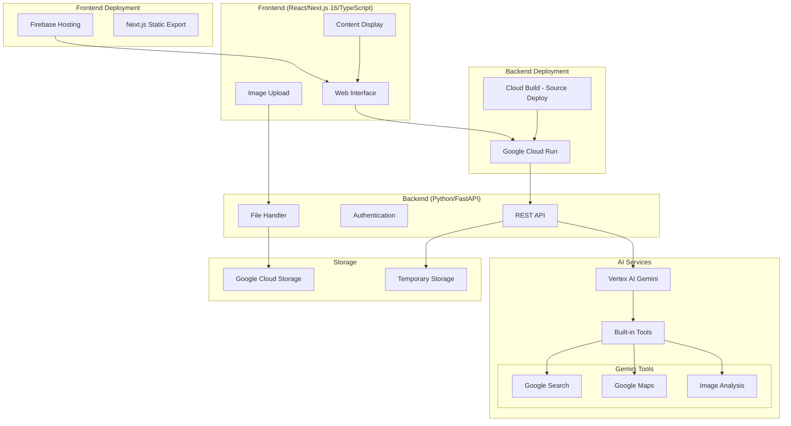
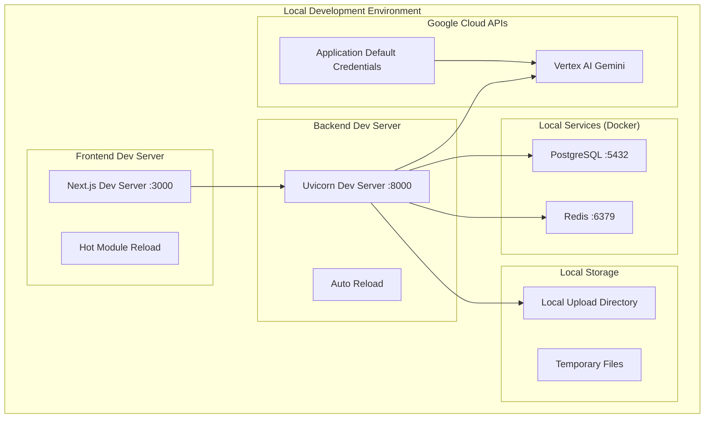

# Design Document: Historical Travel Agent

## Overview

歴史学習特化型旅行AIエージェントシステムは、Geminiの強力なマルチモーダル機能とツール機能を活用して、旅行者に歴史的コンテキストを提供する包括的なシステムです。

システムは以下の2つの主要フェーズで動作します：
1. **旅行前フェーズ**: ユーザーの旅行計画に基づいて歴史情報を収集・整理し、包括的な旅行ガイドを生成
2. **旅行後フェーズ**: ユーザーの写真や感想を分析し、学習体験を振り返るパンフレットを生成

## Architecture

### Production Architecture



### Local Development Architecture



## Project Structure

```
historical-travel-agent/
├── README.md
├── .gitignore
├── docker-compose.yml          # ローカル開発用（PostgreSQL, Redis）
├── .env.example               # 環境変数テンプレート
│
├── frontend/                  # React/Next.js 16/TypeScript フロントエンド
│   ├── package.json
│   ├── pnpm-lock.yaml
│   ├── next.config.js
│   ├── tsconfig.json
│   ├── biome.json            # Biome設定
│   ├── tailwind.config.js    # Tailwind CSS設定
│   ├── public/
│   │   ├── favicon.ico
│   │   └── images/
│   ├── src/
│   │   ├── app/              # Next.js App Router
│   │   │   ├── layout.tsx
│   │   │   ├── page.tsx
│   │   │   ├── travel/
│   │   │   │   ├── page.tsx
│   │   │   │   ├── [id]/
│   │   │   │   │   └── page.tsx
│   │   │   │   └── new/
│   │   │   │       └── page.tsx
│   │   │   ├── reflection/
│   │   │   │   ├── page.tsx
│   │   │   │   └── [id]/
│   │   │   │       └── page.tsx
│   │   │   └── api/          # Next.js API Routes (プロキシ用)
│   │   │       └── proxy/
│   │   ├── components/
│   │   │   ├── ui/           # 共通UIコンポーネント
│   │   │   │   ├── Button.tsx
│   │   │   │   ├── Input.tsx
│   │   │   │   └── Modal.tsx
│   │   │   ├── travel/
│   │   │   │   ├── TravelList.tsx
│   │   │   │   ├── TravelForm.tsx
│   │   │   │   └── SpotSelector.tsx
│   │   │   ├── upload/
│   │   │   │   ├── ImageUploader.tsx
│   │   │   │   └── ReflectionForm.tsx
│   │   │   └── display/
│   │   │       ├── TravelGuide.tsx
│   │   │       └── ReflectionPamphlet.tsx
│   │   ├── lib/
│   │   │   ├── api.ts
│   │   │   ├── utils.ts
│   │   │   └── validations.ts
│   │   ├── types/
│   │   │   ├── travel.ts
│   │   │   ├── guide.ts
│   │   │   └── reflection.ts
│   │   ├── hooks/
│   │   │   ├── useTravel.ts
│   │   │   └── useUpload.ts
│   │   └── styles/
│   │       └── globals.css
│   ├── tests/               # Vitest テスト
│   │   ├── __tests__/
│   │   │   ├── components/
│   │   │   └── pages/
│   │   ├── integration/
│   │   └── e2e/            # Playwright Test Agent
│   └── .next/              # Next.js ビルド出力
│
├── backend/                 # Python/FastAPI バックエンド
│   ├── pyproject.toml      # uv設定
│   ├── uv.lock
│   ├── ruff.toml           # Ruff設定
│   ├── pyrightconfig.json  # Pyright設定
│   ├── .env.local          # ローカル環境変数
│   ├── main.py             # FastAPI エントリーポイント
│   ├── app/
│   │   ├── __init__.py
│   │   ├── api/
│   │   │   ├── __init__.py
│   │   │   ├── routes/
│   │   │   │   ├── __init__.py
│   │   │   │   ├── travel_plans.py
│   │   │   │   ├── reflections.py
│   │   │   │   └── uploads.py
│   │   │   └── dependencies.py
│   │   ├── core/
│   │   │   ├── __init__.py
│   │   │   ├── config.py
│   │   │   ├── security.py
│   │   │   └── exceptions.py
│   │   ├── services/
│   │   │   ├── __init__.py
│   │   │   ├── gemini_service.py
│   │   │   ├── content_generator.py
│   │   │   └── file_handler.py
│   │   ├── models/
│   │   │   ├── __init__.py
│   │   │   ├── travel_plan.py
│   │   │   ├── guide.py
│   │   │   └── reflection.py
│   │   └── utils/
│   │       ├── __init__.py
│   │       └── helpers.py
│   ├── tests/              # pytest テスト
│   │   ├── __init__.py
│   │   ├── conftest.py
│   │   ├── unit/
│   │   │   ├── test_services/
│   │   │   ├── test_models/
│   │   │   └── test_utils/
│   │   ├── integration/
│   │   │   ├── test_api/
│   │   │   └── test_gemini/
│   │   └── property/       # Property-based tests
│   │       ├── test_travel_properties.py
│   │       └── test_content_properties.py
│   ├── uploads/            # ローカル開発用アップロードディレクトリ
│   └── logs/               # ログファイル
│
├── deployment/             # デプロイメント設定
│   ├── docker/             # Docker設定
│   │   ├── Dockerfile.backend
│   │   ├── Dockerfile.frontend
│   │   └── docker-compose.yml    # ローカル開発用
│   ├── terraform/          # Terraform Infrastructure as Code
│   │   ├── main.tf
│   │   ├── variables.tf
│   │   ├── outputs.tf
│   │   ├── versions.tf
│   │   ├── modules/
│   │   │   ├── cloud-run/
│   │   │   │   ├── main.tf
│   │   │   │   ├── variables.tf
│   │   │   │   └── outputs.tf
│   │   │   ├── storage/
│   │   │   │   ├── main.tf
│   │   │   │   ├── variables.tf
│   │   │   │   └── outputs.tf
│   │   │   └── iam/
│   │   │       ├── main.tf
│   │   │       ├── variables.tf
│   │   │       └── outputs.tf
│   │   ├── environments/
│   │   │   ├── dev/
│   │   │   │   ├── terraform.tfvars
│   │   │   │   └── backend.tf
│   │   │   └── prod/
│   │   │       ├── terraform.tfvars
│   │   │       └── backend.tf
│   │   └── .terraform/
│   ├── cloud-build/        # Google Cloud Build設定
│   │   ├── backend-build.yaml
│   │   └── frontend-build.yaml
│   └── scripts/
│       ├── deploy-backend.sh
│       ├── deploy-frontend.sh
│       ├── terraform-init.sh
│       └── terraform-deploy.sh
│
├── docs/                   # ドキュメント
│   ├── api/
│   │   └── openapi.json
│   ├── development/
│   │   ├── setup.md
│   │   └── testing.md
│   ├── deployment/
│   │   ├── terraform-setup.md
│   │   ├── gcp-setup.md
│   │   └── environment-config.md
│   └── infrastructure/
│       ├── architecture.md
│       └── security.md
│
└── .kiro/                  # Kiro設定（既存）
    ├── specs/
    │   └── historical-travel-agent/
    └── steering/
```

### Directory Structure Rationale

#### Frontend Structure
- **Component Organization**: 機能別にコンポーネントを整理（TravelPlanning, PhotoUpload, Display）
- **Type Safety**: TypeScript型定義を`types/`ディレクトリに集約
- **Service Layer**: API通信とビジネスロジックを分離
- **Testing**: Unit, Integration, E2E テストを分離

#### Backend Structure
- **Clean Architecture**: API, Core, Services, Models の層分離
- **FastAPI Best Practices**: ルーティング、依存性注入、設定管理の分離
- **Testing Strategy**: Unit, Integration, Property-based テストの分離
- **Development Support**: ローカル開発用のアップロードディレクトリとログ

#### Deployment Structure
- **Infrastructure as Code**: Terraform でGCP リソース定義の管理
- **Environment Management**: dev/prod 環境の分離管理
- **Module Structure**: 再利用可能なTerraformモジュール
- **Container Support**: Docker設定（ローカル開発用DB、本番デプロイ用）
- **Cloud Build**: Google Cloud Buildでコンテナビルド・デプロイ
- **Automation**: デプロイメントスクリプトの管理

#### Development Workflow
```bash
# ローカル開発環境起動（Docker Compose）
docker-compose up -d  # PostgreSQL, Redis起動

# ローカル開発開始
cd backend && uv run uvicorn main:app --reload --host 0.0.0.0 --port 8000
cd frontend && pnpm dev

# テスト実行
cd backend && uv run pytest
cd frontend && pnpm test

# ビルド
cd frontend && pnpm build
docker build -f deployment/docker/Dockerfile.backend -t backend .
docker build -f deployment/docker/Dockerfile.frontend -t frontend .

# インフラ構築
cd deployment/terraform && terraform init
cd deployment/terraform && terraform plan
cd deployment/terraform && terraform apply

# デプロイ
./deployment/scripts/deploy-backend.sh
./deployment/scripts/deploy-frontend.sh
```

## Components and Interfaces

### Frontend Components
#### 1. Travel Planning Interface
- **目的**: 旅行の管理と旅行先・観光スポットの入力受付
- **技術**: React + Next.js 16 + TypeScript
- **機能**:
  - 旅行一覧表示・選択
  - 新規旅行作成
  - 旅行先入力フォーム
  - 観光スポット選択・追加
  - 生成された旅行ガイドの表示

**ローカル開発設定**:
- **開発サーバー**: `pnpm dev` (Next.js dev server on port 3000)
- **API接続**: `http://localhost:8000` (FastAPI dev server)
- **Hot Module Reload**: ファイル変更時の自動リロード
- **TypeScript**: リアルタイム型チェック
- **App Router**: Next.js 13+ App Router使用

#### 2. Photo Upload Interface  
- **目的**: 旅行後の写真・感想アップロード
- **機能**:
  - ドラッグ&ドロップファイルアップロード
  - 感想・メモ入力フォーム
  - 生成された振り返りパンフレットの表示

### Backend Components

#### 1. API Gateway (FastAPI)
```python
# 主要エンドポイント
GET  /api/travel-plans           # 旅行一覧取得
POST /api/travel-plans          # 旅行計画作成
GET  /api/travel-plans/{id}     # 旅行ガイド取得
PUT  /api/travel-plans/{id}     # 旅行計画更新
POST /api/reflections          # 振り返り作成
POST /api/upload-images        # 画像アップロード
```

**ローカル開発設定**:
- **開発サーバー**: `uvicorn main:app --reload --host 0.0.0.0 --port 8000`
- **CORS設定**: `http://localhost:5173` (Vite dev server) を許可
- **ファイルアップロード**: `./uploads/` ディレクトリに一時保存
- **環境変数**: `.env` ファイルでGoogle Cloud認証情報を管理

#### 2. Gemini Integration Service
- **目的**: Vertex AI Geminiとの統合
- **機能**:
  - Function Calling による外部ツール連携
  - マルチモーダル入力処理（テキスト + 画像）
  - 構造化出力生成

#### 3. Content Generation Engine
- **目的**: 歴史コンテンツの生成・整理
- **機能**:
  - 年表生成
  - 地図情報統合
  - 見どころまとめ作成
  - チェックポイントリスト生成

### AI Service Integration

#### Gemini Built-in Tools活用

1. **Google Search Tool**
   - 観光スポットの歴史情報検索
   - 最新の観光情報取得
   - 歴史的事実の検証

2. **Google Maps Tool**
   - 地理的コンテキストの取得
   - 周辺の歴史的スポット発見
   - ルート最適化

3. **Image Analysis (Vision)**
   - アップロードされた写真の分析
   - 観光スポット・建造物の識別
   - 歴史的要素の抽出

## Data Models

### TravelPlan
```typescript
interface TravelPlan {
  id: string;
  userId: string;
  title: string;              // 旅行のタイトル（例：「京都歴史探訪の旅」）
  destination: string;
  spots: TouristSpot[];
  status: 'planning' | 'completed';  // 旅行の状態
  createdAt: Date;
  updatedAt: Date;
  guide?: TravelGuide;
}

interface TouristSpot {
  name: string;
  location: {
    lat: number;
    lng: number;
  };
  description?: string;
  userNotes?: string;
}
```

### TravelGuide
```typescript
interface TravelGuide {
  id: string;
  planId: string;
  overview: string;
  timeline: HistoricalEvent[];
  spotDetails: SpotDetail[];
  checkpoints: Checkpoint[];
  mapData: MapData;
  generatedAt: Date;
}

interface HistoricalEvent {
  year: number;
  event: string;
  significance: string;
  relatedSpots: string[];
}

interface SpotDetail {
  spotName: string;
  historicalBackground: string;
  highlights: string[];
  recommendedVisitTime: string;
  historicalSignificance: string;
}

interface Checkpoint {
  spotName: string;
  checkpoints: string[];
  historicalContext: string;
}
```

### Reflection
```typescript
interface Reflection {
  id: string;
  planId: string;
  userId: string;
  photos: Photo[];
  userNotes: string;
  pamphlet?: ReflectionPamphlet;
  createdAt: Date;
}

interface Photo {
  id: string;
  url: string;
  analysis: ImageAnalysis;
  userDescription?: string;
}

interface ImageAnalysis {
  detectedSpots: string[];
  historicalElements: string[];
  landmarks: string[];
  confidence: number;
}

interface ReflectionPamphlet {
  id: string;
  reflectionId: string;
  summary: string;
  spotReflections: SpotReflection[];
  nextTravelSuggestions: string[];
  generatedAt: Date;
}

interface SpotReflection {
  spotName: string;
  visitedPhotos: Photo[];
  historicalLearnings: string[];
  personalReflection: string;
}
```

## Correctness Properties

*A property is a characteristic or behavior that should hold true across all valid executions of a system-essentially, a formal statement about what the system should do. Properties serve as the bridge between human-readable specifications and machine-verifiable correctness guarantees.*

### Property Reflection

プロパティの冗長性分析を実行しました：

- Property 1.1（情報受け取り・保存）とProperty 1.5（ガイド生成）は独立した機能をテスト
- Property 1.3（年表生成）とProperty 1.4（地図生成）は異なる出力形式をテストするため統合不要
- Property 2.1（歴史的背景まとめ）とProperty 2.2（見どころ整理）は異なる処理をテストするため独立
- Property 3.1（画像分析）とProperty 3.2（情報統合）は異なる入力タイプを扱うため独立
- すべてのプロパティが独自の検証価値を提供するため、冗長性は検出されませんでした

### Correctness Properties

Property 1: Travel information storage
*For any* valid travel destination and tourist spot information, when input to the system, the Historical_Travel_Agent should successfully store and retrieve the information
**Validates: Requirements 1.1**

Property 2: Web search execution
*For any* travel destination input, the system should execute web search and return historical information results
**Validates: Requirements 1.2**

Property 3: Timeline generation
*For any* collected historical information, the Timeline_Generator should produce a chronologically ordered timeline
**Validates: Requirements 1.3**

Property 4: Map generation with historical context
*For any* collected historical information, the Map_Generator should produce a map containing historical context markers
**Validates: Requirements 1.4**

Property 5: Travel guide completeness
*For any* complete set of travel information (destination, spots, historical data), the system should generate a comprehensive Travel_Guide containing all required components
**Validates: Requirements 1.5**

Property 6: Historical background summarization
*For any* tourist spot information, the system should generate a historical background summary specific to that location
**Validates: Requirements 2.1**

Property 7: Historical highlights organization
*For any* historical information, the system should organize highlights from a historical perspective
**Validates: Requirements 2.2**

Property 8: Checkpoint list inclusion
*For any* generated Travel_Guide, it should contain a Checkpoint_List component
**Validates: Requirements 2.3**

Property 9: Content integration completeness
*For any* generated content, it should integrate timeline, map, historical summary, and highlights into a unified structure
**Validates: Requirements 2.4**

Property 10: Image analysis execution
*For any* uploaded photo, the Image_Analyzer should identify tourist spots and historical elements and return analysis results
**Validates: Requirements 3.1**

Property 11: Information integration
*For any* post-travel input (photos, notes), the system should integrate this information with pre-travel data
**Validates: Requirements 3.2**

Property 12: Information reorganization
*For any* collected post-travel information, the system should reorganize the travel information
**Validates: Requirements 3.3**

Property 13: Reflection pamphlet generation
*For any* reorganized travel information, the system should generate a Reflection_Pamphlet
**Validates: Requirements 3.4**

Property 14: Reflection pamphlet completeness
*For any* generated Reflection_Pamphlet, it should contain travel summary, spot reflections, and next travel suggestions
**Validates: Requirements 3.5**

## Error Handling

### Input Validation
- **Invalid destination input**: システムは適切なエラーメッセージを返し、有効な入力例を提示
- **Unsupported image formats**: サポートされている形式（JPEG, PNG, WebP）のリストを表示
- **Empty or malformed requests**: 必須フィールドの明確な指示を提供

### External Service Failures
- **Gemini API timeout**: 30秒のタイムアウト後、部分的な結果または再試行オプションを提供
- **Google Search tool failure**: キャッシュされた情報または代替検索手段を使用
- **Google Maps tool failure**: 基本的な地理情報のみで継続、後で再試行

### Content Generation Failures
- **Insufficient historical data**: 利用可能な情報で部分的なガイドを生成し、不足部分を明示
- **Image analysis failure**: 手動入力オプションを提供し、分析なしで処理を継続

### Storage and Retrieval Errors
- **File upload failures**: 進行状況表示と再試行メカニズムを実装
- **Data corruption**: バックアップからの復旧とデータ整合性チェック

## Testing Strategy

### Dual Testing Approach

本システムでは、Unit TestingとProperty-Based Testingの両方を活用した包括的なテスト戦略を採用します：

#### Unit Testing
- **具体的な例**: 特定の観光地（例：京都の清水寺）での動作確認
- **エッジケース**: 空の入力、不正な画像形式、ネットワーク障害時の動作
- **統合ポイント**: Gemini APIとの連携、ファイルアップロード機能
- **エラー条件**: 無効な入力データ、API制限超過、タイムアウト

#### Property-Based Testing
- **Universal Properties**: 上記14のCorrectness Propertiesを検証
- **ランダム入力**: 様々な旅行先、観光スポット、画像の組み合わせでテスト
- **最小100回の反復**: 各プロパティテストで十分な入力カバレッジを確保

#### Testing Framework Configuration
- **Frontend**: Vitest（Jest互換API、高速）
- **Backend**: pytest（豊富な機能、Property-based testing対応）
- **Property Testing Library**: Hypothesis（Python）、fast-check（TypeScript）
- **E2E Testing**: Playwright Test Agent（AI支援による自動テスト生成・実行）
- **Test Tagging**: 各プロパティテストに以下の形式でタグ付け
  - **Feature: historical-travel-agent, Property 1: Travel information storage**

#### Test Coverage Requirements
- **Unit Tests**: 具体例、エッジケース、エラー条件に焦点
- **Property Tests**: 汎用的な正確性プロパティの検証
- **Integration Tests**: Gemini API、Google Cloud Storageとの連携確認
- **End-to-End Tests**: Playwright Test Agentを使用した旅行前→旅行後の完全なワークフロー検証

各Correctness PropertyはSINGLEのProperty-based testで実装し、最小100回の反復で実行します。