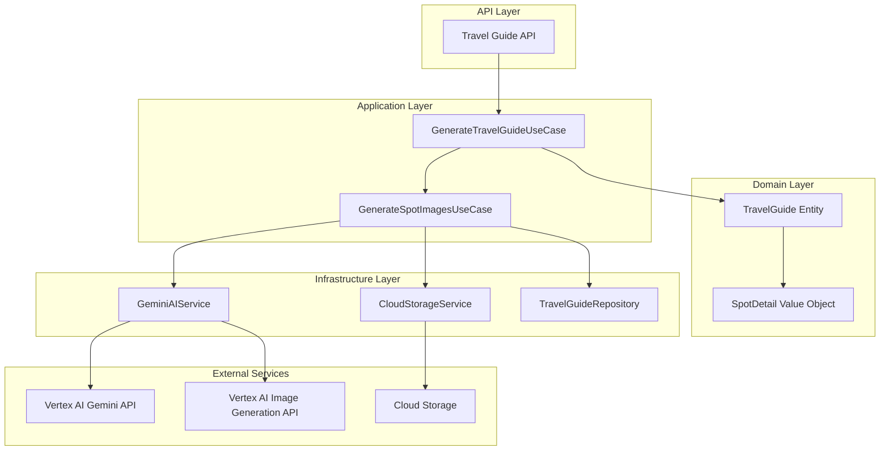
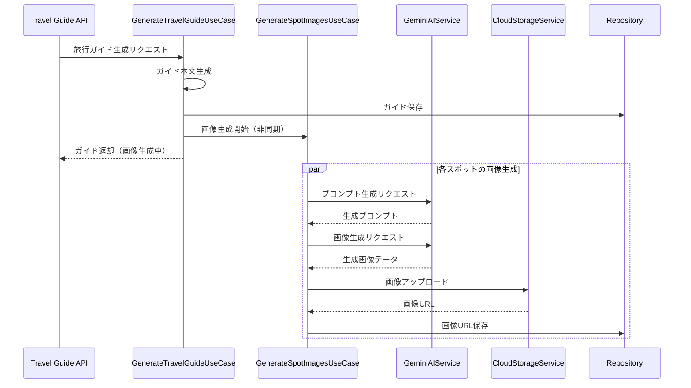

# デザイン文書: スポット画像生成機能

## 概要

本機能は、旅行ガイドアプリケーションに、Gemini APIを使用した画像生成プロンプトの構築と、Vertex AI Image Generation APIを使用したスポット画像の自動生成機能を追加します。画像生成は2段階のプロセスで実行されます：

1. **プロンプト生成フェーズ**: Gemini APIを使用して、スポット情報から画像生成に最適なプロンプトを生成
2. **画像生成フェーズ**: Vertex AI Image Generation APIを使用して、生成されたプロンプトから現実的な写真風の画像を生成

生成された画像はCloud Storageに保存され、各スポットの詳細情報と共にフロントエンドに返されます。画像生成は旅行ガイド生成とは独立して非同期で実行され、ガイド生成の完了を待たずに返却されます。フロントエンドでは、ページ読み込み時に画像URLが存在すれば表示し、存在しなければプレースホルダーを表示します（リアルタイム更新は行いません）。

### アーキテクチャ

### システム構成図



### 処理フロー



## コンポーネントとインターフェース

### 1. IAIService インターフェースの拡張

既存のIAIServiceインターフェースに画像生成メソッドを追加します。

**注意:** 既存のGeminiClientはテキスト生成と画像分析のみをサポートしています。
画像生成機能を追加するには、Vertex AI Image Generation API用の新しいクライアント実装が必要です。

```python
class IAIService(ABC):
    """AIサービスのインターフェース"""
    
    # 既存のメソッド...
    
    @abstractmethod
    async def generate_image_prompt(
        self,
        spot_name: str,
        historical_background: str | None = None,
        *,
        system_instruction: str | None = None,
        temperature: float | None = None,
    ) -> str:
        """スポット情報から画像生成プロンプトを生成する
        
        Args:
            spot_name: スポット名
            historical_background: 歴史的背景（オプション）
            system_instruction: システム命令（オプション）
            temperature: 生成の多様性を制御するパラメータ
            
        Returns:
            str: 画像生成用プロンプト
        """
        pass
    
    @abstractmethod
    async def generate_image(
        self,
        prompt: str,
        *,
        aspect_ratio: str = "16:9",
        timeout: int = 60,
    ) -> bytes:
        """画像を生成する
        
        Note:
            このメソッドはVertex AI Image Generation APIを使用します。
            既存のGeminiClientとは異なる実装が必要です。
        
        Args:
            prompt: 画像生成プロンプト
            aspect_ratio: アスペクト比（"16:9", "1:1", "9:16"など）
            timeout: タイムアウト秒数
            
        Returns:
            bytes: 生成された画像データ（JPEG形式）
            
        Raises:
            AIServiceConnectionError: 接続エラー
            AIServiceQuotaExceededError: クォータ超過エラー
            AIServiceInvalidRequestError: 不正リクエストエラー
        """
        pass
```

### 2. GeminiAIService アダプタの拡張

既存のGeminiAIServiceアダプタに画像生成メソッドを実装します。

**重要:** 画像生成には新しいクライアント実装が必要です。

```python
class GeminiAIService(IAIService):
    """Gemini AIサービスアダプタ"""
    
    def __init__(
        self,
        gemini_client: GeminiClient,
        image_generation_client: ImageGenerationClient,  # 新規追加
        *,
        default_temperature: float = 0.7,
        default_max_output_tokens: int = 8192,
        default_timeout_seconds: int = 60,
    ) -> None:
        """初期化
        
        Args:
            gemini_client: GeminiClientインスタンス（テキスト生成用）
            image_generation_client: ImageGenerationClientインスタンス（画像生成用）
            default_temperature: デフォルトの温度パラメータ
            default_max_output_tokens: デフォルトの最大出力トークン数
            default_timeout_seconds: デフォルトのタイムアウト秒数
        """
        self.client = gemini_client
        self.image_client = image_generation_client  # 新規追加
        self.default_temperature = default_temperature
        self.default_max_output_tokens = default_max_output_tokens
        self.default_timeout_seconds = default_timeout_seconds
    
    async def generate_image_prompt(
        self,
        spot_name: str,
        historical_background: str | None = None,
        *,
        system_instruction: str | None = None,
        temperature: float | None = None,
    ) -> str:
        """スポット情報から画像生成プロンプトを生成する"""
        # 既存のGeminiClientを使用してプロンプトを生成
        pass
    
    async def generate_image(
        self,
        prompt: str,
        *,
        aspect_ratio: str = "16:9",
        timeout: int = 60,
    ) -> bytes:
        """画像を生成する"""
        # 新しいImageGenerationClientを使用して画像を生成
        return await self.image_client.generate_image(
            prompt=prompt,
            aspect_ratio=aspect_ratio,
            timeout=timeout,
        )
```

### ImageGenerationClient（新規実装が必要）

Vertex AI Image Generation API専用のクライアント：

```python
class ImageGenerationClient:
    """Vertex AI Image Generation APIクライアント"""
    
    def __init__(
        self,
        project_id: str,
        location: str = "asia-northeast1",
        model_name: str = "gemini-2.5-flash-image",
    ) -> None:
        """初期化
        
        Args:
            project_id: Google CloudプロジェクトID
            location: Vertex AIのロケーション
            model_name: 使用するモデル名
        """
        self.project_id = project_id
        self.location = location
        self.model_name = model_name
        
        # Vertex AI Image Generation API用のクライアント初期化
        # google.genai.Clientを使用
        self._client = genai.Client(
            vertexai=True,
            project=project_id,
            location=location,
        ).aio
    
    async def generate_image(
        self,
        prompt: str,
        *,
        aspect_ratio: str = "16:9",
        timeout: int = 60,
        max_retries: int = 3,
    ) -> bytes:
        """画像を生成する
        
        Args:
            prompt: 画像生成プロンプト
            aspect_ratio: アスペクト比
            timeout: タイムアウト秒数
            max_retries: 最大リトライ回数
            
        Returns:
            bytes: 生成された画像データ（JPEG形式）
        """
        # Vertex AI Image Generation APIを呼び出す
        # responseModalities: ["IMAGE"]を指定
        # imageConfig: {aspectRatio: aspect_ratio}を指定
        pass
```

### 3. GenerateSpotImagesUseCase

スポット画像生成のユースケース。既存のユースケースパターンに従います。

```python
class GenerateSpotImagesUseCase:
    """スポット画像生成ユースケース"""
    
    def __init__(
        self,
        ai_service: IAIService,
        storage_service: IStorageService,
        guide_repository: ITravelGuideRepository,
        max_concurrent: int = 3,
    ) -> None:
        """初期化
        
        Args:
            ai_service: AIサービス
            storage_service: ストレージサービス
            guide_repository: 旅行ガイドリポジトリ
            max_concurrent: 最大同時実行数
        """
        self._ai_service = ai_service
        self._storage_service = storage_service
        self._guide_repository = guide_repository
        self._max_concurrent = max_concurrent
    
    async def execute(
        self,
        plan_id: str,
        spot_details: list[SpotDetail],
    ) -> None:
        """スポット画像を生成する
        
        Args:
            plan_id: 旅行計画ID
            spot_details: スポット詳細リスト
            
        Note:
            このメソッドは非同期で実行され、呼び出し元は完了を待たない
            各スポットの画像生成完了後、個別にDBを更新する
        """
        pass
    
    async def _generate_single_spot_image(
        self,
        plan_id: str,
        spot_detail: SpotDetail,
    ) -> tuple[str, str | None, str]:
        """単一スポットの画像を生成する
        
        Args:
            plan_id: 旅行計画ID
            spot_detail: スポット詳細
            
        Returns:
            tuple[str, str | None, str]: (スポット名, 画像オブジェクトパス or None, ステータス)
        """
        pass
    
    async def _update_spot_image_status(
        self,
        plan_id: str,
        spot_name: str,
        image_url: str | None,
        image_status: str,
    ) -> None:
        """スポットの画像ステータスを更新する
        
        Args:
            plan_id: 旅行計画ID
            spot_name: スポット名
            image_url: 画像オブジェクトパス（失敗時はNone）
            image_status: 画像生成ステータス
            
        Note:
            TravelGuideを取得し、該当スポットのSpotDetailを更新して保存する
        """
        pass
```

**スポット単位の更新フロー:**

1. TravelGuideをplan_idで取得
2. spot_detailsから該当スポットを見つける
3. 新しいSpotDetailインスタンスを生成（image_url, image_statusを更新）
4. TravelGuide.update_guide()で更新
5. リポジトリに保存

### 4. SpotDetail Value Object の拡張

既存のSpotDetail値オブジェクトに画像関連フィールドを追加します。

```python
@dataclass(frozen=True)
class SpotDetail:
    """スポット詳細"""
    
    spot_name: str
    historical_background: str
    highlights: tuple[str, ...]
    recommended_visit_time: str
    historical_significance: str
    image_url: str | None = None  # 新規追加
    image_status: str = "not_started"  # 新規追加: "not_started", "processing", "succeeded", "failed"
```

## データモデル

### 画像生成ステータス

```python
class ImageGenerationStatus(str, Enum):
    """画像生成ステータス"""
    
    NOT_STARTED = "not_started"  # 未開始
    PROCESSING = "processing"    # 生成中
    SUCCEEDED = "succeeded"      # 成功
    FAILED = "failed"            # 失敗
```

### SpotDetail値オブジェクトの拡張と更新戦略

既存のSpotDetail値オブジェクトに画像関連フィールドを追加します：

```python
@dataclass(frozen=True)
class SpotDetail(ValueObject):
    """スポット詳細"""
    
    spot_name: str
    historical_background: str
    highlights: tuple[str, ...]
    recommended_visit_time: str
    historical_significance: str
    image_url: str | None = None  # 新規追加（署名付きURL）
    image_status: str = "not_started"  # 新規追加
    
    def __post_init__(self) -> None:
        """バリデーション"""
        # 既存のバリデーション...
        
        # 画像ステータスのバリデーション
        valid_statuses = {"not_started", "processing", "succeeded", "failed"}
        if self.image_status not in valid_statuses:
            raise ValueError(
                f"image_status must be one of {valid_statuses}, got: {self.image_status}"
            )
```

**更新戦略（frozen=Trueのため）:**

SpotDetailはimmutableなので、ステータス更新には新しいインスタンスを生成します：

```python
def update_spot_image(
    spot_detail: SpotDetail,
    image_url: str | None,
    image_status: str,
) -> SpotDetail:
    """スポット画像情報を更新した新しいSpotDetailを生成する"""
    return SpotDetail(
        spot_name=spot_detail.spot_name,
        historical_background=spot_detail.historical_background,
        highlights=spot_detail.highlights,
        recommended_visit_time=spot_detail.recommended_visit_time,
        historical_significance=spot_detail.historical_significance,
        image_url=image_url,  # 署名付きURL
        image_status=image_status,
    )
```

**既存データの互換性:**

既存のspot_detailsには画像フィールドが存在しないため、リポジトリ層での変換時にデフォルト値を設定：

```python
def _to_entity(self, model: TravelGuideModel) -> TravelGuide:
    """SQLAlchemyモデル → ドメインエンティティ変換"""
    spot_details = [
        SpotDetail(
            spot_name=detail["spotName"],
            historical_background=detail["historicalBackground"],
            highlights=detail["highlights"],
            recommended_visit_time=detail["recommendedVisitTime"],
            historical_significance=detail["historicalSignificance"],
            image_url=detail.get("imageUrl"),  # デフォルトNone
            image_status=detail.get("imageStatus", "not_started"),  # デフォルト"not_started"
        )
        for detail in model.spot_details
    ]
    # ...
```

### データベーススキーマ

既存のTravelGuideModelはspot_detailsをJSON型で保存しているため、スキーマ変更は不要です。
リポジトリ層で画像関連フィールドを含めた変換を行います。

### Cloud Storage パス構造と署名付きURL

**重要な設計上の決定:**

既存のCloudStorageServiceは`upload_file()`が署名付きURLを返すため、**DBには署名付きURLを保存**します。
ただし、署名付きURLは7日間で失効するため、以下の対応が必要です：

**対応方針:**
1. **短期的対応（MVP）**: 署名付きURLをそのまま保存し、7日間有効
2. **長期的対応（将来の拡張）**: オブジェクトパスも保存し、API呼び出し時に再生成

**MVP実装:**

保存パス構造：

```
{bucket_name}/travel-guides/{plan_id}/spots/{spot_name_safe}.jpg
```

- `bucket_name`: 環境変数で設定されたバケット名
- `plan_id`: 旅行計画ID
- `spot_name_safe`: スポット名をURLセーフに変換したもの

スポット名の変換ルール（`urllib.parse.quote`を使用）：
- URLセーフでない文字をパーセントエンコーディング
- 例: "金閣寺" → "%E9%87%91%E9%96%A3%E5%AF%BA"
- 例: "Eiffel Tower" → "Eiffel%20Tower"

**データベース保存:**
- `image_url`フィールドには、CloudStorageService.upload_file()が返す**署名付きURL**を保存
- 例: `"https://storage.googleapis.com/bucket/travel-guides/plan-123/spots/%E9%87%91%E9%96%A3%E5%AF%BA.jpg?X-Goog-Algorithm=..."`

**API レスポンス時:**
- DBに保存された署名付きURLをそのまま返す

実装例：
```python
from urllib.parse import quote

def _get_image_path(plan_id: str, spot_name: str) -> str:
    """画像保存パスを生成する"""
    spot_name_safe = quote(spot_name, safe='')
    return f"travel-guides/{plan_id}/spots/{spot_name_safe}.jpg"

async def _upload_and_get_url(
    self,
    image_data: bytes,
    plan_id: str,
    spot_name: str,
) -> str:
    """画像をアップロードして署名付きURLを取得する"""
    path = self._get_image_path(plan_id, spot_name)
    # CloudStorageService.upload_file()は署名付きURLを返す
    signed_url = await self._storage_service.upload_file(
        file_data=image_data,
        destination=path,
        content_type="image/jpeg",
    )
    return signed_url
```

**注意:** 署名付きURLは7日間で失効します。長期的には、オブジェクトパスも保存して再生成する仕組みが必要です。

### APIレスポンススキーマ拡張

既存の旅行ガイドAPIレスポンスに画像関連フィールドを追加：

```json
{
  "spotDetails": [
    {
      "spotName": "金閣寺",
      "historicalBackground": "...",
      "highlights": ["..."],
      "recommendedVisitTime": "...",
      "historicalSignificance": "...",
      "imageUrl": "https://storage.googleapis.com/...",
      "imageStatus": "succeeded"
    }
  ]
}
```

**重要な区別:**
- **TravelGuideResponseSchema（AIからの出力検証用）**: 画像フィールドを含まない
- **TravelGuideResponse（APIレスポンス用）**: 画像フィールドを含む

AIが生成するのはテキストコンテンツのみで、画像は後から非同期で追加されます。
そのため、AI出力検証スキーマとAPIレスポンススキーマは異なります。

**APIレスポンス生成時の処理:**

DBに保存された署名付きURLをそのまま返します（MVPでは再生成しない）：

```python
# APIエンドポイントでの処理例
async def get_travel_guide(plan_id: str) -> TravelGuideResponse:
    dto = await use_case.execute(plan_id)
    
    # DTOからAPIレスポンスを生成
    # image_urlは署名付きURLなのでそのまま使用
    return TravelGuideResponse(
        id=dto.id,
        plan_id=dto.plan_id,
        overview=dto.overview,
        timeline=[HistoricalEventSchema(**event) for event in dto.timeline],
        spot_details=[SpotDetailSchema(**spot) for spot in dto.spot_details],
        checkpoints=[CheckpointSchema(**checkpoint) for checkpoint in dto.checkpoints],
        created_at=dto.created_at,
        updated_at=dto.updated_at,
    )
```

## 正確性プロパティ

正確性プロパティとは、システムのすべての有効な実行において真であるべき特性や振る舞いのことです。これらは人間が読める仕様と機械で検証可能な正確性保証の橋渡しとなります。


### プロパティ反映

prework分析から、以下のプロパティの冗長性を確認しました：

**統合可能なプロパティ:**
- 5.2（ステータスを生成中に更新）、5.3（ステータスを成功に更新）、5.4（ステータスを失敗に更新）は、単一の「ステータス遷移」プロパティに統合可能
- 8.2（成功時のレスポンス）、8.3（進行中のレスポンス）、8.4（失敗時のレスポンス）は、単一の「ステータスに応じたレスポンス」プロパティに統合可能
- 7.1（Vertex AIエラーログ）と7.2（Cloud Storageエラーログ）は、単一の「エラーログ」プロパティに統合可能

**除外するプロパティ:**
- 2.5（フォトリアリスティック）: 画像品質は人間の判断が必要
- 6.2（asyncio使用）: 実装の詳細

### 正確性プロパティ

#### プロパティ1: プロンプト生成の完全性

*すべての*有効なスポット情報（名前と歴史的背景）に対して、Gemini APIを使用してプロンプトを生成する場合、生成されたプロンプトはスポット名と歴史的背景の両方を含むべきである

**検証要件: 要件1.1, 1.2, 1.3**

#### プロパティ2: 画像生成APIの呼び出し

*すべての*有効なプロンプトに対して、Vertex AI Image Generation APIを呼び出す場合、API呼び出しが成功すれば画像データが返され、失敗すれば適切なエラーが発生するべきである

**検証要件: 要件2.1, 2.2, 2.3**

#### プロパティ3: Cloud Storageパス構造

*すべての*生成画像に対して、Cloud Storageにアップロードする場合、保存パスは`travel-guides/{plan_id}/spots/{spot_name_urlencoded}.jpg`の形式に従い、upload_file()は署名付きURLを返すべきである

**検証要件: 要件3.1, 3.2, 3.3, 3.4**

#### プロパティ4: 非同期画像生成

*すべての*旅行ガイド生成リクエストに対して、画像生成は非同期で開始され、ガイド生成の完了は画像生成の完了を待たないべきである

**検証要件: 要件4.1, 4.5**

#### プロパティ5: ステータス遷移の正確性

*すべての*スポットに対して、画像生成のステータスは以下の遷移に従うべきである：
- 開始時: not_started → processing
- 成功時: processing → succeeded（画像URLを保存）
- 失敗時: processing → failed

**検証要件: 要件5.1, 5.2, 5.3, 5.4**

#### プロパティ6: 並列処理の完全性

*すべての*複数スポットの画像生成リクエストに対して、並列実行された場合、一部のタスクが失敗しても成功したタスクの結果は返されるべきである

**検証要件: 要件6.1, 6.3, 6.4, 6.5**

#### プロパティ7: エラーログの完全性

*すべての*エラー（Vertex AI APIエラー、Cloud Storageエラー）に対して、適切なコンテキスト（スポット情報を含む）とともにログに記録されるべきである

**検証要件: 要件7.1, 7.2, 7.5**

#### プロパティ8: リトライロジックの正確性

*すべての*レート制限エラーに対して、指数バックオフリトライが実装され、リトライ可能なエラーとリトライ不可能なエラーが区別されるべきである

**検証要件: 要件7.3, 7.4**

#### プロパティ9: APIレスポンスの完全性

*すべての*旅行ガイドAPIレスポンスに対して、各スポット詳細はimageUrlとimageStatusフィールドを含み、ステータスに応じて以下の値を持つべきである：
- succeeded: imageUrl = Cloud Storage URL, imageStatus = "succeeded"
- processing: imageUrl = null, imageStatus = "processing"
- failed: imageUrl = null, imageStatus = "failed"

**検証要件: 要件8.1, 8.2, 8.3, 8.4**

#### プロパティ10: 後方互換性

*すべての*既存のAPIコンシューマーに対して、新しいフィールド（imageUrl, imageStatus）が追加されても、既存のフィールドは変更されず、APIは引き続き動作するべきである

**検証要件: 要件8.5**

#### プロパティ11: フロントエンド画像表示

*すべての*スポットカードに対して、ページ読み込み時にimageUrlが存在すれば画像を表示し、存在しなければプレースホルダーを表示し、アスペクト比を維持し、適切なalt属性を設定するべきである

**検証要件: 要件10.1, 10.2, 10.4, 10.5**

## エラーハンドリング

### エラー分類

システムは以下のエラーを区別して処理します：

#### リトライ可能なエラー
- `AIServiceQuotaExceededError`: API クォータ超過（429エラー）
- `AIServiceConnectionError`: 接続エラー、タイムアウト、サービス利用不可（500系エラー）

#### リトライ不可能なエラー
- `AIServiceInvalidRequestError`: 不正なリクエスト（400エラー）
- `StorageUploadError`: Cloud Storageアップロードエラー（設定ミスなど）

### エラーハンドリング戦略

```python
# 指数バックオフリトライ
async def _retry_with_backoff(
    self,
    func: Callable,
    max_retries: int = 3,
) -> Any:
    """指数バックオフでリトライする"""
    for attempt in range(max_retries):
        try:
            return await func()
        except (AIServiceQuotaExceededError, AIServiceConnectionError) as e:
            if attempt == max_retries - 1:
                raise
            wait_time = min(2 ** attempt, 8)  # 最大8秒
            await asyncio.sleep(wait_time)
        except AIServiceInvalidRequestError:
            # リトライしない
            raise
```

### ログ出力

すべてのエラーは以下の情報とともにログに記録されます：

```python
logger.error(
    "Image generation failed",
    extra={
        "plan_id": plan_id,
        "spot_name": spot_name,
        "error_type": type(e).__name__,
        "error_message": str(e),
    },
    exc_info=True,
)
```

## テスト戦略

### デュアルテストアプローチ

本機能のテストは、ユニットテストとプロパティベーステストの両方を使用します：

- **ユニットテスト**: 特定の例、エッジケース、エラー条件を検証
- **プロパティベーステスト**: すべての入力に対する普遍的なプロパティを検証

### プロパティベーステスト設定

- **テストライブラリ**: Hypothesis（Python）
- **最小イテレーション数**: 100回
- **タグ形式**: `# Feature: spot-image-generation, Property {number}: {property_text}`

### テスト対象

#### バックエンド（Python）

**ユニットテスト:**
- ImageGenerationClientの初期化と設定
- SpotImagePromptBuilderのプロンプトテンプレート
- Cloud Storageパス生成ロジック
- エラーハンドリングの各ケース
- ステータス遷移の各ケース

**プロパティベーステスト:**
- プロパティ1: プロンプト生成の完全性
- プロパティ2: 画像生成APIの呼び出し
- プロパティ3: Cloud Storageパス構造
- プロパティ4: 非同期画像生成
- プロパティ5: ステータス遷移の正確性
- プロパティ6: 並列処理の完全性
- プロパティ7: エラーログの完全性
- プロパティ8: リトライロジックの正確性
- プロパティ9: APIレスポンスの完全性
- プロパティ10: 後方互換性

#### フロントエンド（TypeScript）

**ユニットテスト:**
- スポットカードコンポーネントのレンダリング
- プレースホルダー画像の表示
- alt属性の設定

**プロパティベーステスト:**
- プロパティ11: フロントエンド画像表示

### テスト実行

```bash
# バックエンド
cd backend
uv run pytest tests/ -v

# フロントエンド
cd frontend
pnpm test
```

## 実装の詳細

### 非同期実行とDBセッション管理

画像生成は旅行ガイド生成とは独立したバックグラウンドタスクとして実行されます。

**重要な設計上の注意点:**
- 画像生成タスクは独立したDBセッションを使用する必要があります
- 旅行ガイド生成のセッションは、ガイド保存後に閉じられます
- 画像生成タスクは、新しいセッションを作成して実行します

```python
# 旅行ガイド生成ユースケース内での呼び出し例
async def execute(self, plan_id: str, *, commit: bool = True) -> TravelGuideDTO:
    # ガイド生成処理...
    saved_guide = self._guide_repository.save(generated_guide, commit=commit)
    
    # 画像生成を非同期で開始（別セッションで実行）
    # FastAPIのBackgroundTasksを使用
    # background_tasks.add_task(
    #     self._image_use_case.execute,
    #     plan_id=plan_id,
    #     spot_details=saved_guide.spot_details
    # )
    
    return TravelGuideDTO.from_entity(saved_guide)
```

### プロンプトテンプレート

画像生成プロンプトを構築するためのGemini用プロンプトテンプレート：

```
スポット名: {spot_name}
歴史的背景: {historical_background}

上記のスポット情報から、Vertex AI Image Generation APIで使用する画像生成プロンプトを作成してください。

要件:
- 日本語で記述すること
- リアルで写真のようなスタイルを指定すること
- スポットの特徴と歴史的背景を反映すること
- 具体的で詳細な描写を含めること
- 100-200文字程度にまとめること

プロンプトのみを出力してください。説明や前置きは不要です。
```

### 並列処理の実装

```python
async def _generate_images_parallel(
    self,
    plan_id: str,
    spot_details: list[SpotDetail],
) -> list[tuple[str, str | None, str]]:
    """複数スポットの画像を並列生成する
    
    Returns:
        list[tuple[str, str | None, str]]: (スポット名, 画像URL or None, ステータス)
    """
    semaphore = asyncio.Semaphore(self._max_concurrent)
    
    async def _generate_with_semaphore(spot: SpotDetail):
        async with semaphore:
            try:
                return await self._generate_single_spot_image(plan_id, spot)
            except Exception as e:
                logger.error(
                    f"Image generation failed for spot: {spot.spot_name}",
                    extra={"plan_id": plan_id, "spot_name": spot.spot_name},
                    exc_info=True,
                )
                # 失敗した場合もステータスを返す
                return (spot.spot_name, None, "failed")
    
    tasks = [_generate_with_semaphore(spot) for spot in spot_details]
    results = await asyncio.gather(*tasks, return_exceptions=False)
    
    return results
```

### 設定管理

環境変数による設定：

```python
# backend/app/config/settings.py

class Settings(BaseSettings):
    # 既存の設定...
    
    # 画像生成設定
    image_generation_model: str = "gemini-2.5-flash-image"
    image_generation_location: str = "asia-northeast1"
    image_generation_max_concurrent: int = 3
    image_generation_aspect_ratio: str = "16:9"
    image_generation_timeout: int = 60
    
    class Config:
        env_file = ".env"
```

### データ永続化

既存のTravelGuideModelはspot_detailsをJSON型で保存しているため、データベーススキーマの変更は不要です。
リポジトリ層で画像関連フィールド（imageUrl, imageStatus）を含めた変換を行います。

```python
# リポジトリでの変換例
def _spot_details_to_dict(self, spot_details: list[SpotDetail]) -> list[dict]:
    """SpotDetail → 辞書変換（JSON型で保存するため）"""
    return [
        {
            "spotName": detail.spot_name,
            "historicalBackground": detail.historical_background,
            "highlights": list(detail.highlights),
            "recommendedVisitTime": detail.recommended_visit_time,
            "historicalSignificance": detail.historical_significance,
            "imageUrl": detail.image_url,  # 新規追加
            "imageStatus": detail.image_status,  # 新規追加
        }
        for detail in spot_details
    ]
```

## セキュリティ考慮事項

### 1. 画像コンテンツの安全性

Vertex AI Image Generation APIは、以下の安全性フィルターを提供します：

- 性的コンテンツのブロック
- 暴力的コンテンツのブロック
- ヘイトスピーチのブロック
- 危険なコンテンツのブロック

システムは、これらのフィルターを有効にし、不適切な画像の生成を防ぎます。

### 2. Cloud Storageアクセス制御

**画像URL方式: 署名付きURL（7日間有効）**

既存のCloudStorageServiceを使用し、署名付きURLを生成します：
- 生成された画像は署名付きURL（7日間有効）でアクセス
- バケット自体は非公開設定
- 書き込みはサービスアカウントのみに制限
- バケットレベルでのIAMポリシー設定

**注意:** 公開URLではなく署名付きURLを使用するため、URLは7日間で期限切れになります。
長期的なアクセスが必要な場合は、フロントエンドで定期的にAPIを呼び出して最新のURLを取得する必要があります。

### 3. APIキーとクレデンシャル

- Vertex AI認証は環境変数またはサービスアカウントキーを使用
- クレデンシャルはコードにハードコードしない
- 本番環境ではSecret Managerを使用

## パフォーマンス考慮事項

### 1. 並列処理の最適化

- デフォルトの最大同時実行数: 3
- セマフォによる並行実行数の制限
- リソース枯渇の防止

### 2. タイムアウト設定

- Gemini APIプロンプト生成: 30秒
- Vertex AI画像生成: 60秒
- Cloud Storageアップロード: 30秒

### 3. 画像の保存と取得

- 生成された画像はCloud Storageに永続化
- 既存のCloudStorageServiceを使用（署名付きURL、7日間有効）
- 同じスポットの再生成を避けるため、既存の画像URLをチェック

## 監視とロギング

### ログレベル

- **DEBUG**: API呼び出しの詳細、パラメータ
- **INFO**: 画像生成の開始・完了
- **WARNING**: リトライ、部分的失敗
- **ERROR**: 画像生成失敗、API エラー

### メトリクス

以下のメトリクスを収集します：

- 画像生成成功率
- 平均生成時間
- API エラー率
- Cloud Storageアップロード成功率

## 今後の拡張

### フェーズ2の機能候補

1. **画像キャッシュの最適化**: 同じスポットの画像を再利用
2. **画像バリエーション**: 複数の画像を生成し、ユーザーが選択
3. **画像編集機能**: 生成後の画像を編集
4. **リアルタイム更新**: WebSocketを使用した画像生成状況のリアルタイム通知
5. **画像品質評価**: AIによる生成画像の品質評価と自動再生成
