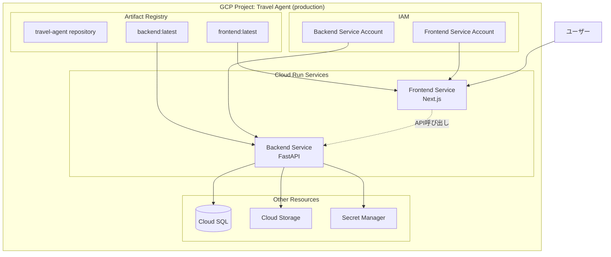

# 第４回 AI Hackathon with Google Cloud 提出作品開発リポジトリ

## 概要

このリポジトリは、[第4回 Agentic AI Hackathon with Google Cloud](https://zenn.dev/hackathons/google-cloud-japan-ai-hackathon-vol4) に提出するプロジェクトの開発リポジトリです。

## ハッカソンについて

### テーマ
「進化するAIと共に。君だけの「エージェント」を創り出そう。」

自律的に動作するAIエージェント開発を中心テーマとした、第4回目のGoogle Cloud AI Hackathonです。最新の「Gemini 3」モデルとAntiGravityなどのツールを活用した次世代AIコーディングが体験できます。

### スケジュール
- **応募期間**: 2025年12月10日～2026年2月15日
- **1次審査**: 2月16日～23日
- **2次審査**: 2月24日～3月2日
- **最終イベント**: 2026年3月19日（Google Cloud Agentic AI Summit '26 Spring）

### 賞金
- **最優秀賞**: 50万円（1件）
- **優秀賞**: 25万円×3件
- **奨励賞**: 10万円×5件

### 必須要件
プロジェクトはGoogle Cloudの実行プロダクト（App Engine、Cloud Run、GKE等）とAI技術（Vertex AI、Gemini API等）の両方を組み合わせて利用する必要があります。

### 審査基準

#### 課題の新規性
多くの人が抱えていて、いまだに解決策が与えられていない課題を発見したプロジェクトを評価します。

#### 解決策の有効性
提案されたソリューションがその中心となる課題に効果的に対処し、解決しているかを評価します。

#### 実装品質と拡張性
開発者がアイデアをどの程度実現し、必要なツールを活用し、拡張性があり、運用しやすく、費用対効果の高いソリューションを作成できたかを評価します。

---

## プロジェクト概要

### プロジェクト名
<!-- プロジェクト名を記載 -->

**_History Learning Agent_**

### 一行説明
<!-- プロジェクトを一言で説明 -->

歴史学習のサポートおよび自分専用の歴史体験記作成エージェント

## 解決する課題
<!-- 現在どのような問題があり、誰がどのように困っているのかを具体的に記載 -->

- 歴史教育の難解さ
  - 教科書の暗記が中心
  - 歴史に興味を持ちにくい
  - 現代とかけ離れていてイメージが湧かない
- 知識の断片化
  - 年号や事実の言葉による説明だけで臨場感がない
  - 教科書には必要最低限のことしか書かれない

### 背景
<!-- なぜこの課題に取り組むのか、社会的背景や個人的な動機を記載 -->

- 歴史の結びつきを考えるきっかけになる
- 事前学習および実体験、振り返りは記憶定着率が高い
- 楽しい教育学習の需要は拡大中

### ターゲットユーザー
<!-- このプロジェクトが解決を目指す対象者・ユーザー層を記載 -->

- 学生
- 教育者
- 歴史好き
- 観光者

## ソリューション（解決策の有効性）

### 提案する解決策
<!-- AIエージェントを使ってどのように課題を解決するのかを記載 -->

事前、道中の情報収集をAIエージェントでサポートし、実体験を楽しく振り返り記憶の定着に貢献するような自分だけのコンテンツを自律的に提供するエージェントを作成し解決を試みる

### 主な機能

- 行先への事前学習
  - その土地の名所と説明
  - その土地の年表
- 道中の注釈サポート
  - 現在地からスポットの提案
- 行った先の事後学習
  - 自分専用のパンフレット

### 期待される効果
<!-- このソリューションによって得られる効果・メリットを記載 -->

- 歴史に対してドキドキワクワクする
- 歴史的体験を記憶だけじゃなく物理的な思い出も残る

## アーキテクチャ（実装品質と拡張性）

### システム構成



### 前提条件
- **開発環境**:
  - [just](https://github.com/casey/just) - タスクランナー（`brew install just`でインストール）
  - [uv](https://github.com/astral-sh/uv) - Pythonパッケージ管理（`brew install uv`でインストール）
  - [pnpm](https://pnpm.io/) - Node.jsパッケージ管理（`brew install pnpm`でインストール）
  - Python 3.12以上
  - Node.js 18以上
- **必要なアカウント**:
  - Google Cloudアカウント
  - Vertex AI APIの有効化

### セットアップ手順

以下の手順で、backendとデータベースをローカルで起動してAPIが動作する状態を作成します。

#### 1. リポジトリのクローン

```bash
git clone [repository-url]
cd <repository-directory>
```

#### 2. 依存関係のインストール

```bash
just install-all
```

#### 3. Google Cloud認証（必要に応じて）

```bash
gcloud auth application-default login
```

このコマンドでブラウザが開き、Google Cloudアカウントでログインします。

#### 4. 環境変数の設定

```bash
cp backend/.env.example backend/.env
```

**フロントエンドの環境変数**
```bash
cp frontend/.env.local.example frontend/.env.local
```

#### 5. データベース・Redisの起動

```bash
cd infrastructure/docker
docker-compose up -d
```

#### 6. マイグレーションの適用

```bash
just migrate-up
```

#### 7. テスト用データベースの作成

```bash
cd infrastructure/docker
docker-compose exec postgres psql -U postgres -c "CREATE DATABASE travel_agent_test;"
```

#### 8. 動作確認

バックエンド開発サーバーを起動:
```bash
just dev-backend
```

### マイグレーション管理コマンド

```bash
# マイグレーション作成
just migrate-create "マイグレーション名"

# マイグレーション適用
just migrate-up

# マイグレーション取り消し（1つ前に戻る）
just migrate-down

# マイグレーション履歴表示
just migrate-history

# 現在のリビジョン表示
just migrate-current

# データベースリセット（開発用）
just db-reset

# 本番DBマイグレーション適用（ローカル端末から直接実行）
cd backend
uv sync

PROJECT_ID=
DATABASE_HOST=
DATABASE_NAME="travel_agent"
DATABASE_USER="backend_user"

DATABASE_URL="" \
DATABASE_HOST="${DATABASE_HOST}" \
DATABASE_NAME="${DATABASE_NAME}" \
DATABASE_USER="${DATABASE_USER}" \
DATABASE_PASSWORD="$(gcloud secrets versions access latest --secret=db-password-production --project=${PROJECT_ID})" \
uv run alembic upgrade head

# 適用リビジョン確認
DATABASE_URL="" \
DATABASE_HOST="${DATABASE_HOST}" \
DATABASE_NAME="${DATABASE_NAME}" \
DATABASE_USER="${DATABASE_USER}" \
DATABASE_PASSWORD="$(gcloud secrets versions access latest --secret=db-password-production --project=${PROJECT_ID})" \
uv run alembic current
```

**注意**: 本番環境へのマイグレーション適用前には、必ずバックアップを取得してください。
Cloud Run Service起動時には自動でマイグレーションされないため、本番デプロイ後にローカル端末から直接 `uv run alembic upgrade head` を実行してください。
`DATABASE_PASSWORD` は Secret Manager の `db-password-production` から取得してください（`roles/secretmanager.secretAccessor` が必要です）。
`.env` の `DATABASE_URL` が優先されるため、`DATABASE_URL=""` を指定して明示的に無効化してください。

### pre-commit
pre-commit（コミット前フック管理ツール）を使い、コミット前に `just check-quality-commit` と `just test-all` を実行します。

```bash
pre-commit install
```

必要に応じて、全ファイルに対して手動実行できます。

```bash
pre-commit run --all-files
```

### ローカル開発

#### 開発サーバーの起動

```bash
# バックエンド + フロントエンド同時起動
just dev-all

# または個別に起動
just dev-backend   # バックエンドのみ（http://localhost:8000）
just dev-frontend  # フロントエンドのみ（http://localhost:3000）
```

#### スポット画像生成ワーカーの起動

スポット画像生成はバックエンドとは別プロセスで実行されます。
ローカルで画像生成を行う場合は、ワーカーを起動してください。

```bash
just dev-worker
```

同時実行数は `backend/.env` の `IMAGE_GENERATION_MAX_CONCURRENT` で調整します。

#### API仕様書

バックエンドAPIの仕様書は以下の方法で確認できます。

**ローカル開発環境**（開発サーバー起動後）:
- Swagger UI: http://localhost:8000/docs
- ReDoc: http://localhost:8000/redoc
- OpenAPI JSON: http://localhost:8000/openapi.json

**静的ファイル**:
- [OpenAPI仕様書（JSON）](docs/backend/openapi.json)
- [バックエンドAPI仕様書README](docs/backend/README.md)

**仕様書の更新**:
```bash
# APIエンドポイントやスキーマを変更した後に実行
just docs-generate-openapi
```

#### よく使うタスク

```bash
# コマンド一覧を表示
just

# テスト実行
just test-all              # 全テスト実行
just test-backend          # バックエンドのみ
just test-frontend         # フロントエンドのみ
just test-backend-cov      # カバレッジ付き（バックエンド）

# コード品質チェック
just check-quality         # 全品質チェック（Lint + Format + 型チェック）
just lint-all              # Lint実行
just format-all            # フォーマット実行
just typecheck-all         # 型チェック実行

# ビルド
just build-frontend        # フロントエンドのプロダクションビルド

# データベース管理
just migrate-up            # マイグレーション適用
just migrate-down          # マイグレーション取り消し
just migrate-history       # マイグレーション履歴表示
just migrate-create "name" # マイグレーション作成

# ドキュメント生成
just docs-generate-openapi # OpenAPI仕様書を生成

# クリーンアップ
just clean-all             # キャッシュとビルド成果物を削除
```

利用可能な全コマンドは `just --list` で確認できます。

### CI/CD（GitHub Actions）

プロジェクトでは段階的な品質チェックパイプラインを採用しています。

#### パイプライン概要

```
PR作成/更新 → Stage 1: Lint Check → Stage 2: Code Quality Check → ✅ Ready for Review
```

- **Stage 1**: コードスタイル・型チェック (`just check-quality`)
- **Stage 2**: テスト実行・ビルド検証 (`just test-backend-cov`, `just test-frontend`, `just build-frontend`)

各ステージは前のステージが成功した場合のみ実行され、失敗時はパイプラインが終了します。

#### ローカルでの事前チェック

CI/CDと全く同じコマンドでローカルチェックが可能：

```bash
just install-all      # 依存関係インストール
just check-quality    # Stage 1相当
just test-backend-cov # Stage 2相当（バックエンドテスト）
just test-frontend    # Stage 2相当（フロントエンドテスト）
just build-frontend   # Stage 2相当（ビルド）
```

#### 詳細情報

CI/CDワークフローの詳細な設計・仕様・トラブルシューティングについては、以下のドキュメントを参照してください：

📖 **[CI/CDワークフロー設計書](docs/actions/ci-workflow-design.md)**


## デモ

### デプロイURL
[デプロイされたアプリケーションのURLを記載]

### スクリーンショット
[アプリケーションのスクリーンショットを追加]

### デモ動画
[デモ動画のリンクまたは埋め込みを追加]

## 提出物

ハッカソンへの提出には以下が必要です：

1. **GitHubリポジトリURL**（公開）- このリポジトリ
2. **デプロイURL** - [URLを記載予定]
3. **Zennの記事** - [記事URLを記載予定]
   - アーキテクチャ図
   - デモ動画（3分程度）

## ライセンス

[ライセンスを記載予定]
