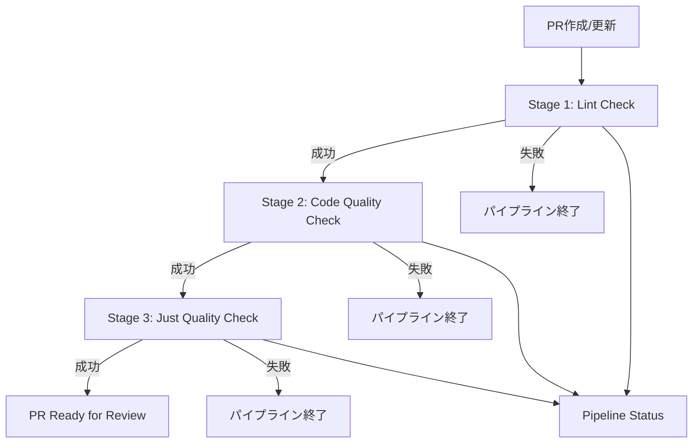

# CI/CD ワークフロー設計書

## 概要

このドキュメントでは、Historical Travel Agentプロジェクトで採用している段階的品質チェックパイプラインの設計について説明します。

## 設計方針

### 基本原則

1. **責務分離**: 各ワークフローが明確な責務を持つ
2. **段階的実行**: 前ステージ成功時のみ次ステージを実行
3. **早期終了**: エラー発見時点でパイプライン停止
4. **効率的実行**: 変更検出による条件実行
5. **保守性**: ワークフローファイルの独立性と可読性

### アーキテクチャ



## ワークフロー構成

### 1. Stage 1: Lint Check (`01-lint-check.yml`)

**責務**: コードスタイル・型チェック

**トリガー**:
```yaml
on:
  pull_request:
    types: [opened, reopened, synchronize]
    branches: [main, develop]
```

**実行内容**:
- 変更検出（frontend/backend）
- フロントエンド:
  - TypeScript型チェック (`pnpm run typecheck`)
  - Biome lint (`pnpm run lint`)
  - Biome format check (`pnpm exec biome format --check .`)
- バックエンド:
  - Pyright型チェック (`uv run pyright`)
  - Ruff lint (`uv run ruff check .`)
  - Ruff format check (`uv run ruff format --check .`)

**出力**:
- `frontend-changed`: フロントエンド変更有無
- `backend-changed`: バックエンド変更有無

**失敗時**: パイプライン終了、Stage 2はスキップ

### 2. Stage 2: Code Quality Check (`02-quality-check.yml`)

**責務**: テスト実行・ビルド検証

**トリガー**:
```yaml
on:
  workflow_run:
    workflows: ["Stage 1: Lint Check"]
    types: [completed]
    branches: [main, develop]
```

**実行条件**: `github.event.workflow_run.conclusion == 'success'`

**実行内容**:
- フロントエンド:
  - テスト実行 (`pnpm run test --run`)
  - ビルドチェック (`pnpm run build`)
- バックエンド:
  - テスト実行 (`uv run pytest --cov=app`)
  - カバレッジレポート生成
  - Codecovへのアップロード

**失敗時**: パイプライン終了、Stage 3はスキップ

### 3. Stage 3: Just Quality Check (`03-just-quality-check.yml`)

**責務**: 最終品質確認

**トリガー**:
```yaml
on:
  workflow_run:
    workflows: ["Stage 2: Code Quality Check"]
    types: [completed]
    branches: [main, develop]
```

**実行条件**: `github.event.workflow_run.conclusion == 'success'`

**実行内容**:
- 全依存関係インストール (`just install-all`)
- 統合品質チェック (`just check-quality`)
- ローカル環境との整合性確認

**成功時**: PR Ready for Review

### 4. Pipeline Status (`pipeline-status.yml`)

**責務**: 全体状況監視・レポート

**トリガー**:
```yaml
on:
  workflow_run:
    workflows: 
      - "Stage 1: Lint Check"
      - "Stage 2: Code Quality Check" 
      - "Stage 3: Just Quality Check"
    types: [completed]
    branches: [main, develop]
```

**実行内容**:
- 各ステージの実行状況取得
- 統合レポート生成
- GitHub Step Summaryでの状況表示

## 技術仕様

### 環境変数

```yaml
env:
  NODE_VERSION: '18'
  PYTHON_VERSION: '3.12'
  PNPM_VERSION: '8'
```

### キャッシュ戦略

**フロントエンド**:
```yaml
- name: Setup pnpm cache
  uses: actions/cache@v4
  with:
    path: ${{ env.STORE_PATH }}
    key: ${{ runner.os }}-pnpm-store-${{ hashFiles('**/pnpm-lock.yaml') }}
```

**バックエンド**:
```yaml
- name: Install uv
  uses: astral-sh/setup-uv@v4
  with:
    enable-cache: true
    cache-dependency-glob: "backend/uv.lock"
```

### 変更検出

```yaml
- name: Detect changes
  uses: dorny/paths-filter@v3
  id: changes
  with:
    filters: |
      frontend:
        - 'frontend/**'
        - 'package.json'
        - 'pnpm-lock.yaml'
      backend:
        - 'backend/**'
        - 'pyproject.toml'
        - 'uv.lock'
```

## エラーハンドリング

### Stage 1失敗時

```yaml
lint-check-failed:
  name: Lint Check Failed
  runs-on: ubuntu-latest
  if: github.event.workflow_run.conclusion == 'failure'
  steps:
    - name: Report failure
      run: |
        echo "## ❌ Stage 1: Lint Check Failed" >> $GITHUB_STEP_SUMMARY
        echo "Please fix the lint errors and push again." >> $GITHUB_STEP_SUMMARY
        exit 1
```

### Stage 2失敗時

```yaml
quality-check-failed:
  name: Quality Check Failed
  runs-on: ubuntu-latest
  if: github.event.workflow_run.conclusion == 'failure'
  steps:
    - name: Report failure
      run: |
        echo "## ❌ Stage 2: Code Quality Check Failed" >> $GITHUB_STEP_SUMMARY
        echo "Please fix the test failures or build errors and push again." >> $GITHUB_STEP_SUMMARY
        exit 1
```

## ローカル開発との連携

### 事前チェックコマンド

```bash
# Stage 1相当: Lint Check
just check-quality

# Stage 2相当: Tests & Build
just test-all
just build-frontend

# Stage 3相当: Just Quality Check  
just check-quality  # 再実行で最終確認
```

### justfileタスク対応表

| CI Stage | justfileタスク | 説明 |
|----------|---------------|------|
| Stage 1 | `just check-quality` | lint + format + typecheck |
| Stage 2 | `just test-all` | 全テスト実行 |
| Stage 2 | `just build-frontend` | フロントエンドビルド |
| Stage 3 | `just check-quality` | 最終品質チェック |

## トラブルシューティング

### よくある問題と解決方法

#### Stage 1で失敗する場合

**問題**: TypeScript型エラー
```bash
# ローカルで確認
pnpm run typecheck

# 修正後
git add .
git commit -m "fix: TypeScript型エラーを修正"
git push
```

**問題**: Biome lintエラー
```bash
# 自動修正可能な場合
pnpm run lint:fix

# 手動修正が必要な場合
pnpm run lint  # エラー内容を確認
```

#### Stage 2で失敗する場合

**問題**: テスト失敗
```bash
# ローカルでテスト実行
just test-all

# 特定のテストのみ実行
cd frontend && pnpm test -- --run specific-test
cd backend && uv run pytest tests/specific_test.py
```

**問題**: ビルド失敗
```bash
# ローカルでビルド確認
just build-frontend

# 詳細なエラー確認
cd frontend && pnpm run build
```

#### Stage 3で失敗する場合

**問題**: Just品質チェック失敗
```bash
# ローカルで確認
just check-quality

# 個別実行で問題箇所特定
just lint-all
just format-all
just typecheck-all
```

### デバッグ方法

1. **GitHub Actions ログ確認**
   - 各ワークフローの詳細ログを確認
   - Step Summaryで概要を把握

2. **ローカル再現**
   - 同じコマンドをローカルで実行
   - 環境差異を確認

3. **段階的確認**
   - Stage 1から順番に確認
   - 失敗したステージに集中

## パフォーマンス最適化

### 実行時間短縮

1. **並列実行**: フロントエンド・バックエンドの独立処理
2. **キャッシュ活用**: 依存関係のキャッシュ
3. **変更検出**: 変更があった部分のみ実行
4. **早期終了**: エラー時の即座停止

### リソース効率化

1. **条件実行**: 必要な場合のみジョブ実行
2. **適切なランナー**: ubuntu-latestの使用
3. **依存関係最小化**: 必要なツールのみインストール

## 今後の拡張予定

### セキュリティ強化

- [ ] Dependabot連携
- [ ] セキュリティ監査の自動化
- [ ] 脆弱性スキャン

### 品質向上

- [ ] コードカバレッジ閾値設定
- [ ] パフォーマンステスト追加
- [ ] E2Eテスト統合

### 運用改善

- [ ] Slack通知連携
- [ ] メトリクス収集
- [ ] 実行時間監視

## 参考資料

- [GitHub Actions Documentation](https://docs.github.com/en/actions)
- [workflow_run Event](https://docs.github.com/en/actions/using-workflows/events-that-trigger-workflows#workflow_run)
- [dorny/paths-filter](https://github.com/dorny/paths-filter)
- [Just Command Runner](https://github.com/casey/just)