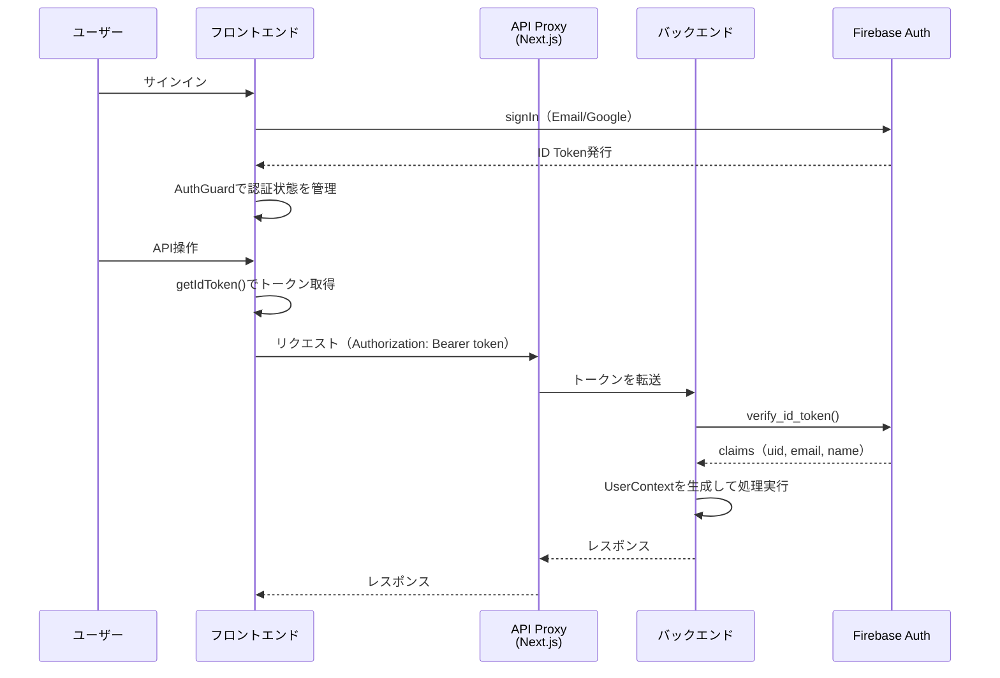

# Firebase Authentication/Authorization 現状と対応方針

## 概要

Firebase Authenticationによる認証基盤を環境変数ベースで導入済み。
本ドキュメントでは現在の実装状況を整理し、今後の対応方針をまとめる。

---

## 1. 現在の実装状況

### 1.1 フロントエンド（認証）

| 項目 | 状態 | ファイル |
|------|------|----------|
| Firebase SDK初期化 | 完了 | `frontend/src/lib/firebase.ts` |
| 認証Hook（useAuth） | 完了 | `frontend/src/hooks/useAuth.ts` |
| 認証Context | 完了 | `frontend/src/contexts/AuthContext.tsx` |
| AuthGuard（ページ保護） | 完了 | `frontend/src/components/features/auth/AuthGuard.tsx` |
| サインイン/サインアップUI | 完了 | `frontend/src/components/features/auth/AuthForm.tsx` |
| サインアウトメニュー | 完了 | `frontend/src/components/layout/Header.tsx` |
| APIクライアントのトークン付与 | 完了 | `frontend/src/lib/api.ts` |
| APIプロキシ（Next.js API Routes） | 完了 | `frontend/src/app/api/v1/[...path]/route.ts` |

**対応済みの認証方式**:
- Email/Passwordによるサインイン・サインアップ
- Google OAuthによるサインイン

**環境変数**（`frontend/.env.local.example` に定義済み）:

| 変数名 | 用途 |
|--------|------|
| `NEXT_PUBLIC_FIREBASE_API_KEY` | Firebase APIキー |
| `NEXT_PUBLIC_FIREBASE_AUTH_DOMAIN` | Firebase Auth domain |
| `NEXT_PUBLIC_FIREBASE_PROJECT_ID` | Firebase project ID |
| `NEXT_PUBLIC_FIREBASE_APP_ID` | Firebase app ID |
| `NEXT_PUBLIC_FIREBASE_STORAGE_BUCKET` | Firebase Storage bucket |
| `NEXT_PUBLIC_FIREBASE_MESSAGING_SENDER_ID` | Firebase Messaging sender ID |

### 1.2 バックエンド（認証・認可）

| 項目 | 状態 | ファイル |
|------|------|----------|
| Firebase Admin SDK初期化 | 完了 | `backend/app/infrastructure/firebase_admin.py` |
| 認証ミドルウェア（require_auth） | 完了 | `backend/app/interfaces/middleware/auth.py` |
| オプショナル認証（optional_auth） | 完了 | `backend/app/interfaces/middleware/auth.py` |
| アプリ起動時のSDK初期化 | 完了 | `backend/main.py`（lifespan） |

**環境変数**（`backend/.env.example` に定義済み）:

| 変数名 | 用途 | 必須 |
|--------|------|------|
| `FIREBASE_PROJECT_ID` | Firebase project ID | Yes |
| `FIREBASE_CLIENT_EMAIL` | サービスアカウントのメールアドレス | ADC未使用時のみ |
| `FIREBASE_PRIVATE_KEY` | サービスアカウントの秘密鍵（PEM形式） | ADC未使用時のみ |

**補足**: Firebase Admin SDKはADC (Application Default Credentials) に対応済み。GCP上では `FIREBASE_PROJECT_ID` のみ設定すれば、Cloud Runにアタッチされたサービスアカウントで自動認証される。ローカル開発では `gcloud auth application-default login` でADCを使用するか、従来通り3つの環境変数をすべて設定する。初期化失敗時は警告ログを出力し、アプリの起動自体は可能。詳細は [GCPデプロイガイド](./gcp-deployment-guide.md) を参照。

### 1.3 認証フロー

### 1.4 エンドポイント別の認証・認可状況

| エンドポイント | 認証 | 所有者チェック | 備考 |
|---------------|------|---------------|------|
| `POST /api/v1/travel-plans` | `require_auth` | `auth.uid`で作成 | user_idが自動設定される |
| `GET /api/v1/travel-plans` | `require_auth` | `auth.uid`でフィルタ | 自分の計画のみ取得 |
| `GET /api/v1/travel-plans/{id}` | `require_auth` | **未実装** | 他ユーザーの計画も取得可能 |
| `PUT /api/v1/travel-plans/{id}` | `require_auth` | **未実装** | 他ユーザーの計画も更新可能 |
| `DELETE /api/v1/travel-plans/{id}` | `require_auth` | **未実装** | 他ユーザーの計画も削除可能 |
| `POST /api/v1/travel-guides/generate` | `require_auth` | **未実装** | 他ユーザーの計画に対しても生成可能 |
| `POST /api/v1/uploads` | `require_auth` | `auth.uid`で検証 | travel_plan.user_idと照合 |
| `POST /api/v1/reflections/generate` | `require_auth` | `auth.uid`で検証 | travel_plan.user_idと照合 |

---

## 2. 未対応の課題

### 2.1 認可（Authorization）の不足

**最優先**: 一部のエンドポイントで所有者チェック（`travel_plan.user_id != auth.uid`）が未実装。認証済みユーザーであれば他人のリソースにアクセスできる状態。

対象:
- `GET /api/v1/travel-plans/{id}` — 所有者以外にも返却される
- `PUT /api/v1/travel-plans/{id}` — 所有者以外も更新可能
- `DELETE /api/v1/travel-plans/{id}` — 所有者以外も削除可能
- `POST /api/v1/travel-guides/generate` — 他ユーザーのplan_idを指定可能

### 2.2 テストの不足

- 認証ミドルウェア（`require_auth`, `optional_auth`）のunitテスト
- 所有者チェックが正しく403を返すことの検証
- E2Eテスト（サインインからAPI操作まで）

### 2.3 セキュリティ強化

- Rate limiting（Firebase Auth側のブルートフォース対策は有効だが、API側は未対応）
- トークンリフレッシュ失敗時のフロントエンド側ハンドリング改善
- CSRFトークンの検討（現状はBearer token方式のため低リスク）

---

## 3. 対応方針

### Phase 1: 認可の完全化（優先度: 高）

すべてのリソース操作エンドポイントに所有者チェックを追加する。

**方針**:
- 各エンドポイントで `travel_plan.user_id != auth.uid` の検証を追加
- 所有者でない場合は `403 Forbidden` を返す
- uploads, reflectionsで既に実装されているパターンを踏襲する

**対象ファイル**:
- `backend/app/interfaces/api/v1/travel_plans.py`
  - `get_travel_plan`: 取得後にuser_idを検証
  - `update_travel_plan`: 更新前にuser_idを検証
  - `delete_travel_plan`: 削除前にuser_idを検証
- `backend/app/interfaces/api/v1/travel_guides.py`
  - `generate_travel_guide`: travel_planの所有者を検証

### Phase 2: テスト拡充（優先度: 高）

**方針**:
- 認証ミドルウェアのunitテストを追加
  - トークンなし → 401
  - 不正トークン → 401
  - 有効トークン → UserContext返却
- 所有者チェックのテストを追加
  - 所有者のリクエスト → 正常応答
  - 非所有者のリクエスト → 403

### Phase 3: 将来の拡張（優先度: 低）

以下は現時点では対応不要だが、将来的に検討する項目。

| 項目 | 概要 | 検討タイミング |
|------|------|---------------|
| ロールベースアクセス制御 | Firebase Custom Claimsでadmin/userロールを管理 | マルチテナント対応時 |
| APIキー認証 | 外部連携やBot向けのAPIキー方式 | 外部API公開時 |
| Rate limiting | IP/ユーザー単位のリクエスト制限 | 本番負荷が増加した場合 |
| セッションキャッシュ | トークン検証結果のサーバーサイドキャッシュ | パフォーマンス問題発生時 |
| 多要素認証（MFA） | Firebase AuthのMFA機能を有効化 | セキュリティ要件の引き上げ時 |
| アカウント連携 | 同一ユーザーのEmail/Google統合 | ユーザーから要望があった場合 |

---

## 4. 環境変数の管理方針

### 4.1 環境分離

| 環境 | 管理方法 | Firebaseプロジェクト |
|------|----------|---------------------|
| ローカル開発 | `.env.local`（gitignore対象） | 開発用プロジェクト |
| CI/CD | GitHub Secrets / Cloud Build環境変数 | 開発用プロジェクト |
| 本番 | Cloud Runの環境変数 / Secret Manager | 本番用プロジェクト |

### 4.2 秘密鍵の取り扱い

- **GCP (Cloud Run)**: ADCを使用するため `FIREBASE_PRIVATE_KEY` の設定は不要
- **ローカル開発（ADC方式）**: `gcloud auth application-default login` で認証。秘密鍵不要
- **ローカル開発（従来方式）**: `FIREBASE_PRIVATE_KEY` はPEM形式で `.env` ファイルに記載（`.gitignore` で除外済み）
- DBパスワード等の秘密情報は本番環境ではGoogle Cloud Secret Managerで管理を推奨
- フロントエンドの `NEXT_PUBLIC_*` 環境変数はクライアントに公開されるため、秘密情報を含めないこと

### 4.3 設定値の確認方法

- フロントエンド: `frontend/.env.local.example` を参照
- バックエンド: `backend/.env.example` を参照
- 新しい環境変数を追加した場合は、必ず `.example` ファイルも更新すること
