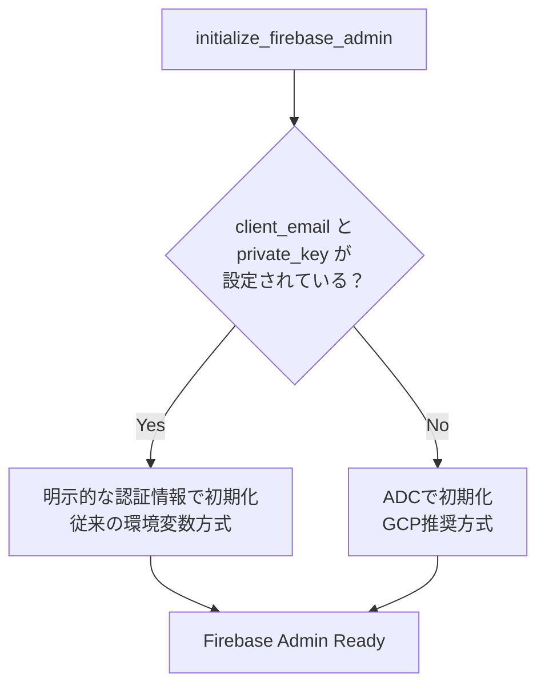
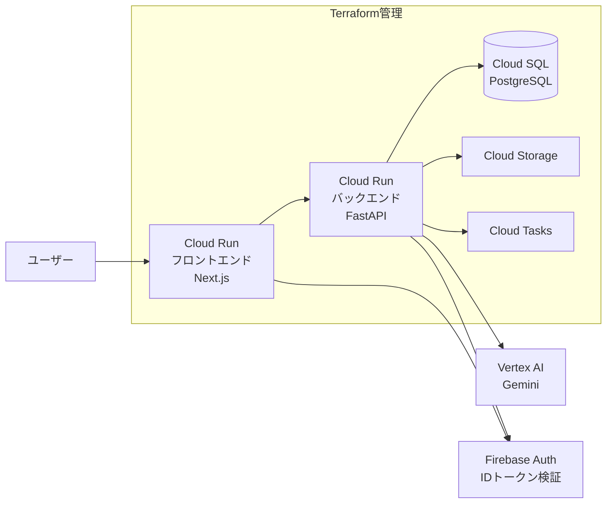

# Firebase Authentication GCPデプロイガイド

## 概要

Firebase Admin SDKの認証をApplication Default Credentials (ADC) に対応させた。
本ドキュメントでは、GCP上で認証を動作させるために必要なセットアップ手順をまとめる。

> **前提**: GCPインフラは `infrastructure/terraform/` で管理されている。
> リソースの作成・変更は原則としてTerraformで行う。

---

## 1. 認証方式の仕組み

バックエンドのFirebase Admin SDK初期化は、以下の優先順位で認証情報を決定する。



| 環境 | 認証方式 | 必要な環境変数 |
|------|----------|---------------|
| GCP (Cloud Run) | ADC（サービスアカウント自動アタッチ） | `FIREBASE_PROJECT_ID` のみ |
| ローカル（ADC） | `gcloud auth application-default login` | `FIREBASE_PROJECT_ID` のみ |
| ローカル（従来方式） | 環境変数で秘密鍵を直接指定 | `FIREBASE_PROJECT_ID`, `FIREBASE_CLIENT_EMAIL`, `FIREBASE_PRIVATE_KEY` |

---

## 2. インフラ構成（Terraform管理）

### 2.1 アーキテクチャ



### 2.2 Terraformモジュール構成

| モジュール | パス | 用途 |
|-----------|------|------|
| `cloud-run` | `modules/cloud-run/` | バックエンド (FastAPI) |
| `cloud-run-frontend` | `modules/cloud-run-frontend/` | フロントエンド (Next.js) |
| `cloud-sql` | `modules/cloud-sql/` | PostgreSQL |
| `cloud-storage` | `modules/cloud-storage/` | 画像アップロード |
| `artifact-registry` | `modules/artifact-registry/` | Dockerイメージ |
| `iam` | `modules/iam/` | サービスアカウント・権限 |
| `secret-manager` | `modules/secret-manager/` | DBパスワード等 |
| `cloud-tasks` | `modules/cloud-tasks/` | 画像生成ジョブ |

---

## 3. ADC対応に必要なTerraform変更

Firebase認証のADC対応にあたり、以下のTerraform変更が必要。

### 3.1 IAMモジュール: `roles/firebaseauth.viewer` の追加

バックエンドのサービスアカウントにFirebase IDトークン検証用のロールを付与する。

**対象ファイル**: `infrastructure/terraform/modules/iam/main.tf`

```hcl
# Firebase Auth権限（IDトークン検証）
resource "google_project_iam_member" "backend_firebase_auth" {
  count   = var.environment == "production" ? 1 : 0
  project = var.project_id
  role    = "roles/firebaseauth.viewer"
  member  = "serviceAccount:${google_service_account.backend[0].email}"
}
```

### 3.2 Cloud Runモジュール: `FIREBASE_PROJECT_ID` 環境変数の追加

バックエンドのCloud RunサービスにFirebaseプロジェクトIDを環境変数として設定する。

**対象ファイル**: `infrastructure/terraform/modules/cloud-run/main.tf`

```hcl
env {
  name  = "FIREBASE_PROJECT_ID"
  value = var.project_id
}
```

### 3.3 現在のIAMロール一覧（変更後）

| ロール | 用途 | Terraform resource | 状態 |
|--------|------|-------------------|------|
| `roles/cloudsql.client` | Cloud SQL接続 | `backend_sql_client` | 設定済み |
| `roles/storage.objectAdmin` | GCSへの画像読み書き | `backend_storage` | 設定済み |
| `roles/secretmanager.secretAccessor` | Secret Manager | `backend_secret_accessor` | 設定済み |
| `roles/aiplatform.user` | Vertex AI (Gemini) | `backend_vertex_ai` | 設定済み |
| `roles/cloudtasks.enqueuer` | Cloud Tasks | `backend_cloud_tasks_enqueuer` | 設定済み |
| `roles/firebaseauth.viewer` | Firebase IDトークン検証 | `backend_firebase_auth` | **追加が必要** |

---

## 4. デプロイ手順

### 4.1 Terraformの適用

```bash
cd infrastructure/terraform

# production workspaceを選択
terraform workspace select production

# 変更内容を確認
terraform plan

# 適用
terraform apply
```

### 4.2 Dockerイメージのビルドとプッシュ

```bash
# Terraform outputからレジストリURLを取得
REGISTRY=$(terraform output -raw artifact_registry_url)

# バックエンド
docker build -t ${REGISTRY}/backend:latest ./backend
docker push ${REGISTRY}/backend:latest

# フロントエンド（NEXT_PUBLIC_* はビルド時に必要）
docker build \
  --build-arg NEXT_PUBLIC_FIREBASE_API_KEY=<value> \
  --build-arg NEXT_PUBLIC_FIREBASE_AUTH_DOMAIN=<project-id>.firebaseapp.com \
  --build-arg NEXT_PUBLIC_FIREBASE_PROJECT_ID=<project-id> \
  --build-arg NEXT_PUBLIC_FIREBASE_APP_ID=<value> \
  --build-arg NEXT_PUBLIC_FIREBASE_STORAGE_BUCKET=<project-id>.firebasestorage.app \
  --build-arg NEXT_PUBLIC_FIREBASE_MESSAGING_SENDER_ID=<value> \
  -t ${REGISTRY}/frontend:latest ./frontend
docker push ${REGISTRY}/frontend:latest
```

> **注意**: フロントエンドの `NEXT_PUBLIC_*` 環境変数はNext.jsのビルド時にバンドルされるため、`--build-arg` で渡す必要がある。実行時の環境変数では反映されない。

### 4.3 Cloud Runサービスの更新

イメージのプッシュ後、Cloud Runサービスを新しいイメージで更新する。

```bash
# Terraform outputからサービス名を取得
BACKEND_NAME=$(terraform output -raw backend_service_name)
FRONTEND_NAME=$(terraform output -raw frontend_service_name)
REGION=asia-northeast1

# バックエンドのデプロイ
gcloud run services update $BACKEND_NAME \
  --image=${REGISTRY}/backend:latest \
  --region=$REGION

# フロントエンドのデプロイ
gcloud run services update $FRONTEND_NAME \
  --image=${REGISTRY}/frontend:latest \
  --region=$REGION
```

---

## 5. Firebase Console の設定

### 5.1 承認済みドメインの追加

Firebase Console > Authentication > Settings > 承認済みドメイン に以下を追加:

```bash
# フロントエンドURLをTerraform outputから取得
terraform output frontend_url
```

- Cloud Run フロントエンドのURL（例: `historical-travel-agent-frontend-production-xxxxx-an.a.run.app`）
- カスタムドメインを使用する場合はそのドメイン

### 5.2 OAuth リダイレクトURIの追加

Google認証を使用する場合、GCP Console > APIとサービス > 認証情報 > OAuth 2.0 クライアント に以下を追加:

- `https://<frontend-url>/__/auth/handler`

### 5.3 APIキーの制限（推奨）

GCP Console > APIとサービス > 認証情報 > APIキー で以下を設定:

- **アプリケーション制限**: HTTPリファラーに本番ドメインのみを許可
- **API制限**: Firebase関連のAPIのみに制限

---

## 6. 環境変数の比較

### バックエンド（Cloud Run）

| 環境変数 | ローカル | GCP (Cloud Run) | Terraform管理 | 備考 |
|----------|----------|-----------------|---------------|------|
| `FIREBASE_PROJECT_ID` | 必須 | 必須 | **要追加** | ADCで使用 |
| `FIREBASE_CLIENT_EMAIL` | ADC未使用時のみ | **不要** | - | ADCで自動解決 |
| `FIREBASE_PRIVATE_KEY` | ADC未使用時のみ | **不要** | - | ADCで自動解決 |
| `GOOGLE_CLOUD_PROJECT` | 任意 | 必須 | 設定済み | Vertex AI等で使用 |
| `DATABASE_*` | 必須 | 必須 | 設定済み | DB接続情報 |
| `DATABASE_PASSWORD` | `.env` | Secret Manager | 設定済み | `secret_key_ref` で参照 |
| `STORAGE_TYPE` | `local` | `gcs` | 設定済み | |
| `GCS_BUCKET_NAME` | - | 必須 | 設定済み | |

### フロントエンド（Cloud Run）

| 環境変数 | ローカル | GCP (Cloud Run) | Terraform管理 | 備考 |
|----------|----------|-----------------|---------------|------|
| `NEXT_PUBLIC_FIREBASE_*` | `.env.local` | **ビルド時に`--build-arg`** | - | 6つすべて必要 |
| `BACKEND_SERVICE_URL` | - | バックエンドURL | 設定済み | API Proxy用 |
| `NODE_ENV` | `development` | `production` | 設定済み | |

---

## 7. ローカル開発でのADC利用

GCP上と同じADC方式をローカルでも使用可能。

```bash
# 1. gcloud CLIでADCを設定（一度だけ実行）
gcloud auth application-default login

# 2. .envにはFIREBASE_PROJECT_IDだけ設定
# FIREBASE_CLIENT_EMAILとFIREBASE_PRIVATE_KEYは不要（削除またはコメントアウト）
```

> **注意**: ADC方式ではユーザーアカウントの認証情報が使われるため、`FIREBASE_PROJECT_ID` の明示指定が必要。

---

## 8. トラブルシューティング

| 症状 | 原因 | 対処 |
|------|------|------|
| Firebase Admin初期化失敗（Cloud Run） | サービスアカウントに `firebaseauth.viewer` がない | IAMモジュールにロールを追加して `terraform apply` |
| Firebase Admin初期化失敗（ローカル） | ADC未設定 | `gcloud auth application-default login` を実行 |
| Google認証でリダイレクトエラー | 承認済みドメイン未登録 | Firebase Console で本番ドメインを追加 |
| フロントエンドでFirebase未初期化 | ビルド時に `NEXT_PUBLIC_*` 未設定 | `--build-arg` で渡してリビルド |
| 認証はできるがAPIが403 | `CORS_ORIGINS` にフロントエンドURLがない | Cloud Runの環境変数で設定 |
| 初期化失敗してもアプリは起動する | 設計通り（try/exceptで保護） | ログで `Firebase Admin SDK initialization failed` を確認 |
