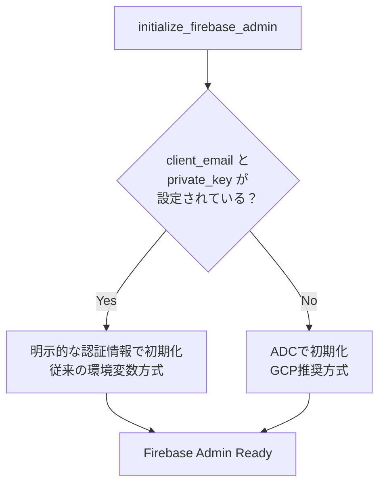

# Firebase Authentication GCPデプロイガイド

## 概要

Firebase Admin SDKの認証をApplication Default Credentials (ADC) に対応させた。
本ドキュメントでは、GCP上で認証を動作させるために必要なセットアップ手順をまとめる。

---

## 1. 認証方式の仕組み

バックエンドのFirebase Admin SDK初期化は、以下の優先順位で認証情報を決定する。



| 環境 | 認証方式 | 必要な環境変数 |
|------|----------|---------------|
| GCP (Cloud Run) | ADC（サービスアカウント自動アタッチ） | `FIREBASE_PROJECT_ID` のみ |
| ローカル（ADC） | `gcloud auth application-default login` | `FIREBASE_PROJECT_ID` のみ |
| ローカル（従来方式） | 環境変数で秘密鍵を直接指定 | `FIREBASE_PROJECT_ID`, `FIREBASE_CLIENT_EMAIL`, `FIREBASE_PRIVATE_KEY` |

---

## 2. GCPで必要なサービス

### 2.1 作成が必要なリソース

| リソース | 用途 | 備考 |
|----------|------|------|
| Cloud Run サービス（バックエンド） | FastAPI のホスティング | `backend/Dockerfile` を使用 |
| Cloud Run サービス（フロントエンド） | Next.js のホスティング | `frontend/Dockerfile` を使用 |
| Artifact Registry リポジトリ | Dockerイメージの保管 | `docker` 形式 |
| Cloud SQL (PostgreSQL) | データベース | `POSTGRES_15` 推奨 |
| サービスアカウント | バックエンド用の認証ID | 後述のIAMロールを付与 |

### 2.2 有効化が必要なAPI

```bash
PROJECT_ID=ankw-ai-hackathon-4
REGION=asia-northeast1

gcloud services enable \
  run.googleapis.com \
  sqladmin.googleapis.com \
  artifactregistry.googleapis.com \
  aiplatform.googleapis.com \
  --project=$PROJECT_ID
```

### 2.3 条件付きで必要なリソース

| リソース | 用途 | 必要な条件 |
|----------|------|-----------|
| Cloud Storage (GCS) バケット | 画像アップロードの保存先 | `STORAGE_TYPE=gcs` |
| Cloud Tasks キュー | 画像生成の非同期ジョブ | `IMAGE_EXECUTION_MODE=cloud_tasks` |
| Memorystore (Redis) | キャッシュ/タスクキュー | Cloud Runから利用する場合 |

---

## 3. サービスアカウントのセットアップ

### 3.1 サービスアカウントの作成

```bash
gcloud iam service-accounts create travel-agent-backend \
  --display-name="Travel Agent Backend" \
  --project=$PROJECT_ID
```

### 3.2 IAMロールの付与

```bash
SA=travel-agent-backend@${PROJECT_ID}.iam.gserviceaccount.com

# 必須ロール
gcloud projects add-iam-policy-binding $PROJECT_ID \
  --member="serviceAccount:$SA" \
  --role="roles/firebaseauth.viewer"

gcloud projects add-iam-policy-binding $PROJECT_ID \
  --member="serviceAccount:$SA" \
  --role="roles/aiplatform.user"

gcloud projects add-iam-policy-binding $PROJECT_ID \
  --member="serviceAccount:$SA" \
  --role="roles/cloudsql.client"
```

条件付きロール（使用する機能に応じて付与）:

```bash
# GCSを使用する場合
gcloud projects add-iam-policy-binding $PROJECT_ID \
  --member="serviceAccount:$SA" \
  --role="roles/storage.objectAdmin"

# Cloud Tasksを使用する場合
gcloud projects add-iam-policy-binding $PROJECT_ID \
  --member="serviceAccount:$SA" \
  --role="roles/cloudtasks.enqueuer"

# Secret Managerを使用する場合
gcloud projects add-iam-policy-binding $PROJECT_ID \
  --member="serviceAccount:$SA" \
  --role="roles/secretmanager.secretAccessor"
```

### 3.3 ロール一覧

| ロール | 用途 | 必須 |
|--------|------|------|
| `roles/firebaseauth.viewer` | Firebase IDトークンの検証 | Yes |
| `roles/aiplatform.user` | Vertex AI (Gemini) API呼び出し | Yes |
| `roles/cloudsql.client` | Cloud SQL接続 | Yes |
| `roles/storage.objectAdmin` | GCSへの画像読み書き | `STORAGE_TYPE=gcs` の場合 |
| `roles/cloudtasks.enqueuer` | Cloud Tasksへのタスク追加 | `IMAGE_EXECUTION_MODE=cloud_tasks` の場合 |
| `roles/secretmanager.secretAccessor` | Secret Managerからの秘密情報取得 | Secret Manager使用時 |

---

## 4. Artifact Registry の準備

```bash
gcloud artifacts repositories create travel-agent \
  --repository-format=docker \
  --location=$REGION \
  --project=$PROJECT_ID
```

---

## 5. Cloud SQL のセットアップ

```bash
# インスタンス作成
gcloud sql instances create travel-agent-db \
  --database-version=POSTGRES_15 \
  --tier=db-f1-micro \
  --region=$REGION \
  --project=$PROJECT_ID

# データベース作成
gcloud sql databases create travel_agent \
  --instance=travel-agent-db \
  --project=$PROJECT_ID

# ユーザー作成
gcloud sql users create app_user \
  --instance=travel-agent-db \
  --password=<SECURE_PASSWORD> \
  --project=$PROJECT_ID
```

---

## 6. Cloud Run デプロイ

### 6.1 Dockerイメージのビルドとプッシュ

```bash
REGISTRY=${REGION}-docker.pkg.dev/${PROJECT_ID}/travel-agent

# バックエンド
docker build -t ${REGISTRY}/backend:latest ./backend
docker push ${REGISTRY}/backend:latest

# フロントエンド（NEXT_PUBLIC_* はビルド時に必要）
docker build \
  --build-arg NEXT_PUBLIC_FIREBASE_API_KEY=<value> \
  --build-arg NEXT_PUBLIC_FIREBASE_AUTH_DOMAIN=${PROJECT_ID}.firebaseapp.com \
  --build-arg NEXT_PUBLIC_FIREBASE_PROJECT_ID=${PROJECT_ID} \
  --build-arg NEXT_PUBLIC_FIREBASE_APP_ID=<value> \
  --build-arg NEXT_PUBLIC_FIREBASE_STORAGE_BUCKET=${PROJECT_ID}.firebasestorage.app \
  --build-arg NEXT_PUBLIC_FIREBASE_MESSAGING_SENDER_ID=<value> \
  -t ${REGISTRY}/frontend:latest ./frontend
docker push ${REGISTRY}/frontend:latest
```

> **注意**: フロントエンドの `NEXT_PUBLIC_*` 環境変数はビルド時にバンドルされるため、`--build-arg` で渡す必要がある。実行時の環境変数では反映されない。

### 6.2 バックエンドのデプロイ

```bash
SA=travel-agent-backend@${PROJECT_ID}.iam.gserviceaccount.com

gcloud run deploy backend \
  --image=${REGISTRY}/backend:latest \
  --service-account=$SA \
  --region=$REGION \
  --set-env-vars="FIREBASE_PROJECT_ID=${PROJECT_ID}" \
  --set-env-vars="GOOGLE_CLOUD_PROJECT=${PROJECT_ID}" \
  --set-env-vars="GOOGLE_CLOUD_LOCATION=${REGION}" \
  --set-env-vars="DATABASE_HOST=/cloudsql/${PROJECT_ID}:${REGION}:travel-agent-db" \
  --set-env-vars="DATABASE_NAME=travel_agent" \
  --set-env-vars="DATABASE_USER=app_user" \
  --add-cloudsql-instances=${PROJECT_ID}:${REGION}:travel-agent-db \
  --project=$PROJECT_ID
```

`DATABASE_PASSWORD` は Secret Manager で管理することを推奨:

```bash
# シークレットの作成
echo -n "<SECURE_PASSWORD>" | gcloud secrets create DATABASE_PASSWORD --data-file=- --project=$PROJECT_ID

# Cloud Runからシークレットを参照
gcloud run deploy backend \
  ... \
  --set-secrets="DATABASE_PASSWORD=DATABASE_PASSWORD:latest"
```

### 6.3 フロントエンドのデプロイ

```bash
gcloud run deploy frontend \
  --image=${REGISTRY}/frontend:latest \
  --region=$REGION \
  --set-env-vars="NEXT_PUBLIC_API_BASE_URL=https://<backend-url>" \
  --project=$PROJECT_ID
```

---

## 7. Firebase Console の設定

### 7.1 承認済みドメインの追加

Firebase Console > Authentication > Settings > 承認済みドメイン に以下を追加:

- Cloud Run フロントエンドのURL（例: `frontend-xxxxx-an.a.run.app`）
- カスタムドメインを使用する場合はそのドメイン

### 7.2 OAuth リダイレクトURIの追加

Google認証を使用する場合、GCP Console > APIとサービス > 認証情報 > OAuth 2.0 クライアント に以下を追加:

- `https://<frontend-url>/__/auth/handler`

### 7.3 APIキーの制限（推奨）

GCP Console > APIとサービス > 認証情報 > APIキー で以下を設定:

- **アプリケーション制限**: HTTPリファラーに本番ドメインのみを許可
- **API制限**: Firebase関連のAPIのみに制限

---

## 8. 環境変数の比較

### バックエンド

| 環境変数 | ローカル | GCP (Cloud Run) | 備考 |
|----------|----------|-----------------|------|
| `FIREBASE_PROJECT_ID` | 必須 | 必須 | プロジェクトID |
| `FIREBASE_CLIENT_EMAIL` | 必須（ADC未使用時） | **不要** | ADCで自動解決 |
| `FIREBASE_PRIVATE_KEY` | 必須（ADC未使用時） | **不要** | ADCで自動解決 |
| `GOOGLE_CLOUD_PROJECT` | 任意 | 必須 | Vertex AI等で使用 |
| `DATABASE_URL` or `DATABASE_*` | 必須 | 必須 | DB接続情報 |
| `CORS_ORIGINS` | デフォルト可 | 必須 | フロントエンドURLを指定 |

### フロントエンド

| 環境変数 | ローカル | GCP (Cloud Run) | 備考 |
|----------|----------|-----------------|------|
| `NEXT_PUBLIC_FIREBASE_*` | `.env.local` | ビルド時に `--build-arg` | 6つの変数すべて必要 |
| `NEXT_PUBLIC_API_BASE_URL` | デフォルト可 | バックエンドURL | API接続先 |

---

## 9. ローカル開発でのADC利用

GCP上と同じADC方式をローカルでも使用可能。

```bash
# 1. gcloud CLIでADCを設定（一度だけ実行）
gcloud auth application-default login

# 2. .envにはFIREBASE_PROJECT_IDだけ設定
# FIREBASE_CLIENT_EMAILとFIREBASE_PRIVATE_KEYは不要（削除またはコメントアウト）
```

> **注意**: ADC方式ではユーザーアカウントの認証情報が使われるため、`FIREBASE_PROJECT_ID` の明示指定が必要。

---

## 10. トラブルシューティング

| 症状 | 原因 | 対処 |
|------|------|------|
| Firebase Admin初期化失敗（Cloud Run） | サービスアカウントに `firebaseauth.viewer` がない | IAMロールを追加 |
| Firebase Admin初期化失敗（ローカル） | ADC未設定 | `gcloud auth application-default login` を実行 |
| Google認証でリダイレクトエラー | 承認済みドメイン未登録 | Firebase Console で本番ドメインを追加 |
| フロントエンドでFirebase未初期化 | ビルド時に `NEXT_PUBLIC_*` 未設定 | `--build-arg` で渡してリビルド |
| 認証はできるがAPIが403 | `CORS_ORIGINS` にフロントエンドURLがない | Cloud Runの環境変数で設定 |
| 初期化失敗してもアプリは起動する | 設計通り（try/exceptで保護） | ログで `Firebase Admin SDK initialization failed` を確認 |
