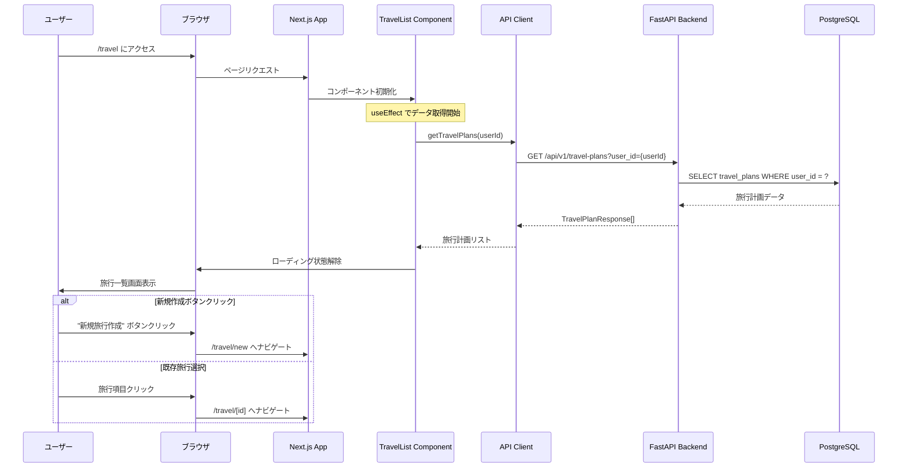
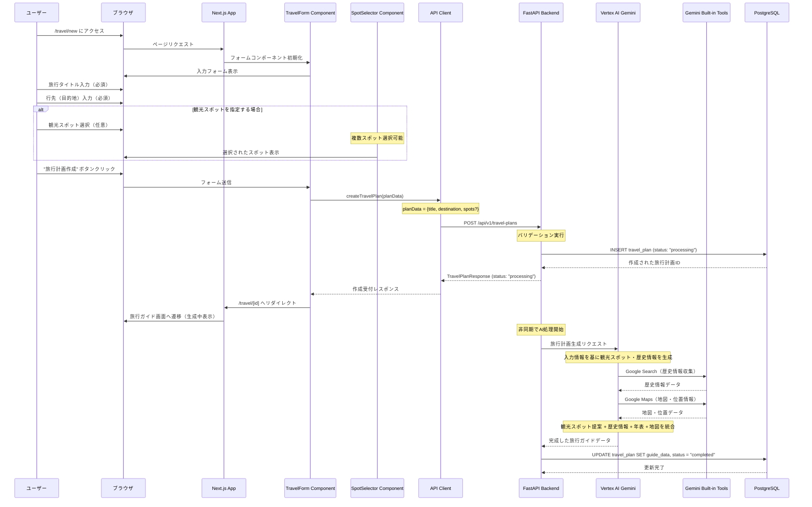
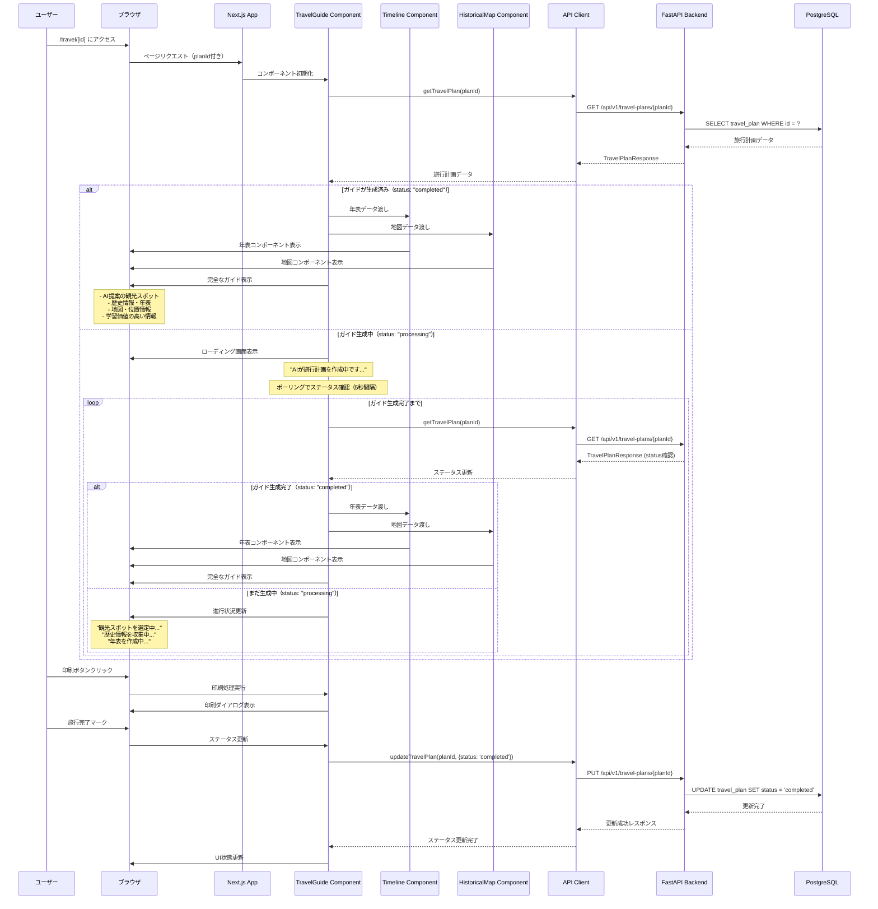
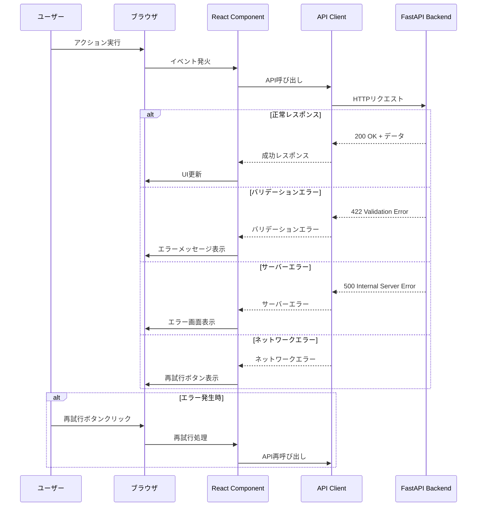
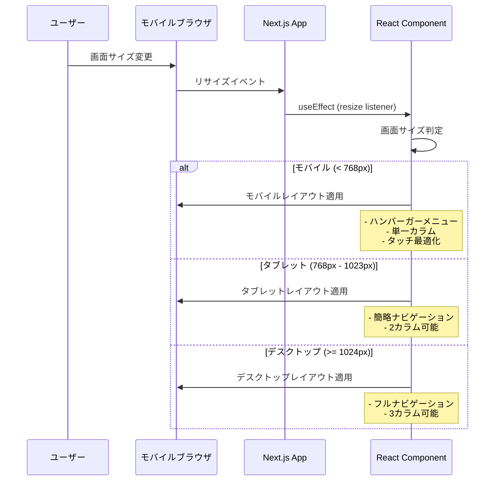

# フロントエンド旅行計画シーケンス図

## 概要

歴史学習特化型旅行AIエージェントシステムのフロントエンド旅行計画部分のシーケンス図です。スタンダードレイアウトを採用し、Next.js 16 App Routerを使用した実装を前提としています。

## 関連ドキュメント

- [画面設計書](./screen-design.md) - 各画面の詳細設計
- [レイアウト構造設計書](./layout-structure.md) - 全体レイアウト構造
- [バックエンドAPI仕様書](../backend/README.md) - API仕様

## 1. 旅行一覧表示フロー

### シーケンス図



### コンポーネント構成

```typescript
// app/travel/page.tsx
export default function TravelListPage() {
  return (
    <Container>
      <Header title="旅行計画" />
      <TravelList />
      <CreateTravelButton />
    </Container>
  );
}

// components/travel/TravelList.tsx
export function TravelList() {
  const [travels, setTravels] = useState<TravelPlan[]>([]);
  const [loading, setLoading] = useState(true);
  
  useEffect(() => {
    fetchTravelPlans();
  }, []);
  
  // API呼び出しとデータ管理
}
```

## 2. 新規旅行作成フロー

### シーケンス図



### フォーム構成

```typescript
// components/travel/TravelForm.tsx
export function TravelForm() {
  const [formData, setFormData] = useState<CreateTravelPlanRequest>({
    userId: '',
    title: '',           // 必須
    destination: '',     // 必須
    spots: []           // 任意（複数選択可能）
  });
  
  const handleSubmit = async (e: FormEvent) => {
    e.preventDefault();
    setLoading(true);
    
    try {
      // spotsが空の場合は送信しない（オプショナル）
      const requestData = {
        ...formData,
        ...(formData.spots.length > 0 && { spots: formData.spots })
      };
      
      const result = await createTravelPlan(requestData);
      router.push(`/travel/${result.id}`);
    } catch (error) {
      setError(error.message);
    } finally {
      setLoading(false);
    }
  };
  
  return (
    <form onSubmit={handleSubmit}>
      <TextField 
        label="旅行タイトル"
        value={formData.title}
        onChange={(value) => setFormData({...formData, title: value})}
        required
      />
      <TextField 
        label="行先（目的地）"
        value={formData.destination}
        onChange={(value) => setFormData({...formData, destination: value})}
        required
      />
      <SpotSelector 
        label="観光スポット（任意）"
        spots={formData.spots}
        onSpotsChange={(spots) => setFormData({...formData, spots})}
        multiple
        optional
      />
      <Button type="submit" loading={loading}>
        旅行計画作成
      </Button>
    </form>
  );
}
```

## 3. 旅行ガイド表示フロー

### シーケンス図



### ガイド表示コンポーネント

```typescript
// components/display/TravelGuide.tsx
export function TravelGuide({ planId }: { planId: string }) {
  const [travelPlan, setTravelPlan] = useState<TravelPlan | null>(null);
  const [loading, setLoading] = useState(true);
  const [generationStatus, setGenerationStatus] = useState<string>('');
  
  useEffect(() => {
    fetchTravelPlan();
    
    // ガイド生成中の場合はポーリング（5秒間隔）
    if (travelPlan?.status === 'processing') {
      const interval = setInterval(fetchTravelPlan, 5000);
      return () => clearInterval(interval);
    }
  }, [planId, travelPlan?.status]);
  
  const fetchTravelPlan = async () => {
    try {
      const plan = await getTravelPlan(planId);
      setTravelPlan(plan);
      
      // 生成状況に応じたメッセージ更新
      if (plan.status === 'processing') {
        updateGenerationStatus(plan);
      }
    } catch (error) {
      setError(error.message);
    } finally {
      setLoading(false);
    }
  };
  
  const updateGenerationStatus = (plan: TravelPlan) => {
    // AI生成の進行状況を表示
    if (!plan.guide) {
      setGenerationStatus('観光スポットを選定中...');
    } else if (!plan.guide.timeline) {
      setGenerationStatus('歴史情報を収集中...');
    } else if (!plan.guide.mapData) {
      setGenerationStatus('年表を作成中...');
    } else {
      setGenerationStatus('最終調整中...');
    }
  };
  
  if (loading) return <LoadingSpinner />;
  if (!travelPlan) return <ErrorMessage />;
  
  return (
    <div className="travel-guide">
      <TravelOverview plan={travelPlan} />
      
      {travelPlan.status === 'completed' && travelPlan.guide ? (
        <>
          <AIGeneratedSpots spots={travelPlan.guide.aiSuggestedSpots} />
          <Timeline events={travelPlan.guide.timeline} />
          <HistoricalMap 
            spots={travelPlan.spots} 
            mapData={travelPlan.guide.mapData} 
          />
          <SpotDetails details={travelPlan.guide.spotDetails} />
          <CheckpointList checkpoints={travelPlan.guide.checkpoints} />
          <EducationalContent content={travelPlan.guide.educationalValue} />
        </>
      ) : (
        <GuideGenerationProgress 
          planId={planId} 
          status={generationStatus}
          message="AIが旅行計画を作成中です..."
        />
      )}
    </div>
  );
}
```

## 4. エラーハンドリングフロー

### シーケンス図



## 5. 状態管理フロー

### React状態管理

```typescript
// hooks/useTravel.ts
export function useTravel() {
  const [travels, setTravels] = useState<TravelPlan[]>([]);
  const [loading, setLoading] = useState(false);
  const [error, setError] = useState<string | null>(null);
  
  const fetchTravels = useCallback(async (userId: string) => {
    setLoading(true);
    setError(null);
    
    try {
      const data = await getTravelPlans(userId);
      setTravels(data);
    } catch (err) {
      setError(err instanceof Error ? err.message : '取得に失敗しました');
    } finally {
      setLoading(false);
    }
  }, []);
  
  const createTravel = useCallback(async (planData: CreateTravelPlanRequest) => {
    setLoading(true);
    setError(null);
    
    try {
      const newPlan = await createTravelPlan(planData);
      setTravels(prev => [...prev, newPlan]);
      return newPlan;
    } catch (err) {
      setError(err instanceof Error ? err.message : '作成に失敗しました');
      throw err;
    } finally {
      setLoading(false);
    }
  }, []);
  
  return {
    travels,
    loading,
    error,
    fetchTravels,
    createTravel
  };
}
```

## 6. API通信フロー

### API Client実装

```typescript
// lib/api.ts
const API_BASE_URL = process.env.NODE_ENV === 'development' 
  ? 'http://localhost:8000' 
  : 'https://your-backend-url.com';

class ApiClient {
  private async request<T>(
    endpoint: string, 
    options: RequestInit = {}
  ): Promise<T> {
    const url = `${API_BASE_URL}${endpoint}`;
    
    const response = await fetch(url, {
      headers: {
        'Content-Type': 'application/json',
        ...options.headers,
      },
      ...options,
    });
    
    if (!response.ok) {
      const error = await response.json();
      throw new Error(error.detail || 'API呼び出しに失敗しました');
    }
    
    return response.json();
  }
  
  async getTravelPlans(userId: string): Promise<TravelPlan[]> {
    return this.request(`/api/v1/travel-plans?user_id=${userId}`);
  }
  
  async getTravelPlan(planId: string): Promise<TravelPlan> {
    return this.request(`/api/v1/travel-plans/${planId}`);
  }
  
  async createTravelPlan(data: CreateTravelPlanRequest): Promise<TravelPlan> {
    return this.request('/api/v1/travel-plans', {
      method: 'POST',
      body: JSON.stringify(data),
    });
  }
  
  async updateTravelPlan(
    planId: string, 
    data: UpdateTravelPlanRequest
  ): Promise<TravelPlan> {
    return this.request(`/api/v1/travel-plans/${planId}`, {
      method: 'PUT',
      body: JSON.stringify(data),
    });
  }
}

export const apiClient = new ApiClient();
```

## 7. レスポンシブ対応フロー

### モバイル・タブレット対応



## 実装優先度

### Phase 1（MVP必須）
1. 旅行一覧表示フロー
2. 新規旅行作成フロー（基本版）
   - 必須項目（タイトル・行先）の入力
   - 任意項目（観光スポット）の選択
   - 非同期処理での受付レスポンス
3. 旅行ガイド表示フロー（基本版）
   - ポーリングによるリアルタイム更新
   - AI生成進行状況の表示
4. エラーハンドリング（基本版）

### Phase 2（機能充実）
1. AI生成コンテンツの詳細表示
   - 観光スポット提案の詳細
   - 歴史情報・年表の充実
   - 教育価値の高い情報表示
2. 印刷・PDF出力機能
3. 旅行完了マーク機能
4. レスポンシブ対応の強化

### Phase 3（UX向上）
1. アニメーション効果
2. オフライン対応
3. プッシュ通知
4. パフォーマンス最適化

## 次のステップ

1. **コンポーネント実装**: 各シーケンス図に基づいたReactコンポーネントの実装
2. **API統合**: バックエンドAPIとの連携実装
3. **状態管理**: React hooksを使用した状態管理の実装
4. **テスト**: 各フローのUnit/Integration/E2Eテスト
5. **レスポンシブ対応**: モバイル・タブレット対応の実装

## 調整されたシーケンス図の主な変更点

### 1. **入力フィールドの調整**
- **必須項目**: 旅行タイトル、行先（目的地）
- **任意項目**: 観光スポット（複数選択可能）
- オプショナルな観光スポットは提案材料として活用

### 2. **AI処理フローの詳細化**
- **Vertex AI Gemini Built-in Tools**を使用
- **Google Search Tool**: 歴史情報収集
- **Google Maps Tool**: 地図・位置情報取得
- AIが観光スポット提案 + 歴史情報 + 年表 + 地図を統合生成

### 3. **非同期処理の実装**
- 旅行計画作成後、即座に受付レスポンス（status: "processing"）
- バックグラウンドでAI生成処理
- フロントエンドでポーリング（5秒間隔）によるリアルタイム更新

### 4. **生成進行状況の表示**
- "観光スポットを選定中..."
- "歴史情報を収集中..."
- "年表を作成中..."
- "最終調整中..."

### 5. **AIが提供する価値**
- **観光スポット提案**: ユーザー入力を基にした最適な観光地選定
- **歴史情報**: 各スポットの歴史的背景と意義
- **年表**: 時系列での歴史的コンテキスト
- **地図**: 歴史的価値を含む位置情報
- **教育価値**: 学習に役立つ情報の提供
- **旅行価値**: 実際の旅行として価値の高い案内

この調整により、ユーザーは最小限の入力（タイトル + 行先）で、AIが包括的で教育価値の高い旅行計画を自動生成する流れが明確になりました。