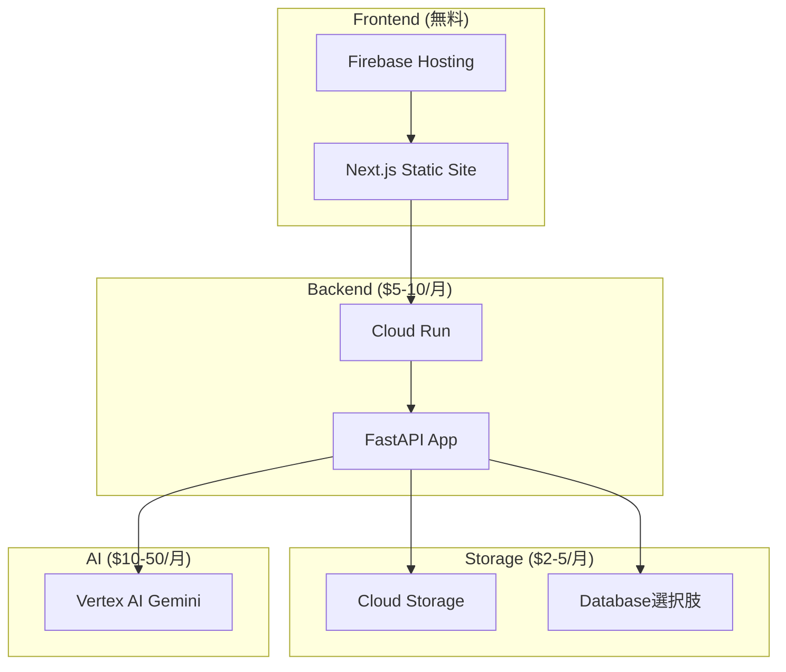

# GCPサービス最小構成 - Historical Travel Agent

## 前提条件

**プロジェクト性質**: 一時的なプロジェクト（ハッカソン・検証用）
**方針**: シンプルにコストを抑えめで妥協できるところは妥協する

## 最小限必要なGCPサービス

### 🔴 絶対必須（4サービス）

#### 1. Cloud Run
- **用途**: FastAPI バックエンド
- **理由**: 
  - ハッカソン必須要件（Google Cloud実行プロダクト）
  - 従量課金でコスト効率が良い
  - 設定が最もシンプル
- **設定**: 最小インスタンス（CPU: 1, Memory: 512Mi）

#### 2. Vertex AI
- **用途**: Gemini API
- **理由**: 
  - ハッカソン必須要件（AI技術）
  - アプリの核となる機能
  - Built-in Tools（Search, Maps）が使える
- **設定**: 従量課金のみ

#### 3. Cloud Storage
- **用途**: 画像ファイル保存
- **理由**: 
  - 写真アップロード機能に必須
  - 安価（$0.02/GB/月）
  - 設定が簡単
- **設定**: Standard ストレージクラス

#### 4. Firebase Hosting
- **用途**: Next.js フロントエンド
- **理由**: 
  - 無料枠が大きい（10GB/月）
  - 設定が最も簡単
  - SSL自動、CDN付き
- **設定**: Spark プラン（無料）

### 🟡 妥協案（データベース）

#### オプション A: Cloud SQL（推奨）
- **用途**: PostgreSQL
- **コスト**: $7-10/月（db-f1-micro）
- **メリット**: 既存コードそのまま、データ永続化確実
- **デメリット**: 最低コストがかかる

#### オプション B: Firestore（コスト重視）
- **用途**: NoSQL データベース
- **コスト**: 無料枠内で収まる可能性大
- **メリット**: 無料枠が大きい、サーバーレス
- **デメリット**: コード変更が必要、SQLAlchemy使えない

#### オプション C: ローカルファイル（超節約）
- **用途**: JSON ファイルでデータ保存
- **コスト**: $0
- **メリット**: 完全無料
- **デメリット**: データ永続化不安定、スケールしない

## 削除・妥協するサービス

### ❌ 削除するサービス
| サービス | 削除理由 | 代替案 |
|---------|---------|--------|
| **Memorystore (Redis)** | $25-30/月と高い | アプリ内メモリキャッシュ |
| **Cloud Build** | GitHub Actions で代替可能 | GitHub Actions（無料） |
| **Artifact Registry** | Docker Hub で代替可能 | Docker Hub（無料） |
| **Cloud Monitoring** | 一時的なので不要 | Cloud Run の基本メトリクス |
| **Cloud Logging** | 一時的なので不要 | stdout ログのみ |
| **Error Reporting** | 一時的なので不要 | 手動デバッグ |
| **Secret Manager** | 環境変数で代替 | Cloud Run 環境変数 |
| **IAM 詳細設定** | デフォルト権限で妥協 | 基本的な IAM のみ |

### 🔄 代替手段
| 機能 | GCP サービス | 代替案 | コスト削減 |
|------|-------------|--------|-----------|
| CI/CD | Cloud Build | GitHub Actions | $0 |
| コンテナレジストリ | Artifact Registry | Docker Hub | $0 |
| キャッシュ | Memorystore | アプリ内メモリ | $25-30/月 |
| 機密管理 | Secret Manager | 環境変数 | $1-2/月 |
| 監視 | Cloud Monitoring | 基本メトリクス | $5-10/月 |

## 最小構成のアーキテクチャ

## コスト見積もり（月額・USD）

### パターン A: Cloud SQL 使用
| サービス | 月額コスト |
|---------|-----------|
| Cloud Run | $5-10 |
| Firebase Hosting | $0（無料枠内） |
| Cloud Storage | $2-3 |
| Cloud SQL (f1-micro) | $7-10 |
| Vertex AI | $10-30 |
| **合計** | **$24-53** |

### パターン B: Firestore 使用
| サービス | 月額コスト |
|---------|-----------|
| Cloud Run | $5-10 |
| Firebase Hosting | $0（無料枠内） |
| Cloud Storage | $2-3 |
| Firestore | $0-2（無料枠） |
| Vertex AI | $10-30 |
| **合計** | **$17-45** |

### パターン C: 超節約版
| サービス | 月額コスト |
|---------|-----------|
| Cloud Run | $5-10 |
| Firebase Hosting | $0（無料枠内） |
| Cloud Storage | $2-3 |
| ローカルファイル | $0 |
| Vertex AI | $10-30 |
| **合計** | **$17-43** |

## 推奨構成

### 🎯 バランス重視: パターン A（Cloud SQL）
**理由**:
- 既存コードの変更が最小限
- データの永続化が確実
- 月額 $24-53 は許容範囲
- 開発効率が最も高い

### 💰 コスト最重視: パターン B（Firestore）
**理由**:
- 月額 $17-45 でより安価
- Firestore の無料枠が大きい
- コード変更は必要だが学習価値あり

## 実装上の妥協点

### 1. 認証
- **妥協**: Firebase Auth なし
- **代替**: 簡単なAPIキー認証またはなし

### 2. 監視・ログ
- **妥協**: 詳細監視なし
- **代替**: Cloud Run の基本メトリクスのみ

### 3. キャッシュ
- **妥協**: Redis なし
- **代替**: アプリ内メモリキャッシュ

### 4. セキュリティ
- **妥協**: 最小限のIAM設定
- **代替**: 基本的な権限のみ

### 5. 可用性
- **妥協**: 単一リージョン、冗長化なし
- **代替**: Cloud Run の基本的な可用性に依存

## セットアップの簡素化

### 1. 手動設定で十分
- Terraform は使わず、コンソールで手動設定
- 設定項目を最小限に絞る

### 2. 環境は1つのみ
- dev/prod 分離なし
- 単一環境で開発・デモ

### 3. CI/CD は GitHub Actions
- Cloud Build は使わない
- シンプルなデプロイスクリプト

## 次のステップ

1. **データベース選択の決定**
   - Cloud SQL vs Firestore vs ローカルファイル

2. **簡単なセットアップガイド作成**
   - 手動設定手順
   - 環境変数一覧

3. **デプロイスクリプト作成**
   - GitHub Actions ワークフロー
   - 一発デプロイ設定

## 注意事項

⚠️ **この構成の制限**
- 本格運用には不適切
- データバックアップが不十分
- 監視・アラートが最小限
- セキュリティが基本レベル
- スケーラビリティに制限

✅ **適用場面**
- ハッカソン・プロトタイプ
- 概念実証（PoC）
- 短期間のデモ
- 学習・実験目的