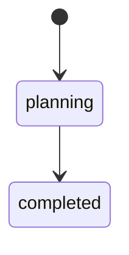
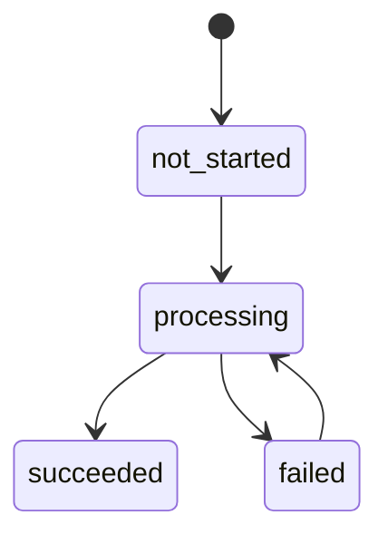

# 状態定義と遷移方針

## 目的

旅行計画の状態とAI生成の状態を分離し、用途・更新責務・遷移を明確化する

## 用語

- 計画ステータス: 旅行計画そのもののライフサイクル状態
- 生成ステータス: AI生成（ガイド/振り返り）の進行状態

## 計画ステータス（PlanStatus）

### 定義

- planning: 計画中
- completed: 旅行完了

### 遷移

### 更新責務

- `PUT /travel-plans/{id}` で計画ステータスを更新する
- 生成ステータスはここでは更新しない

## 生成ステータス（GenerationStatus）

ガイド生成と振り返り生成は別のステータスとして管理する

### 定義

- not_started: 生成未開始
- processing: 生成中
- succeeded: 生成完了
- failed: 生成失敗

### 遷移

### 更新責務

- 生成系APIで更新する
- 計画ステータスとは独立して遷移する
  - `TravelPlan.update_generation_statuses()` を呼び出し、`TravelPlanRepository.save()` で永続化する
  - `PUT /travel-plans/{id}` では生成ステータスは更新しない

### 更新タイミング

- ガイド生成開始: `guide_generation_status = processing`
- ガイド生成成功: `guide_generation_status = succeeded`
- ガイド生成失敗: `guide_generation_status = failed`
- 振り返り生成開始: `reflection_generation_status = processing`
- 振り返り生成成功: `reflection_generation_status = succeeded`
- 振り返り生成失敗: `reflection_generation_status = failed`

## 保存先

- 生成前にガイド/振り返りレコードが存在しないため、`travel_plans` に保持する
- 想定フィールド例:
  - `guide_generation_status`
  - `reflection_generation_status`

## 現状のstatus利用箇所

- ドメイン定義: `backend/app/domain/travel_plan/value_objects.py`
- 永続化: `backend/app/infrastructure/persistence/models.py`
- リポジトリ変換: `backend/app/infrastructure/repositories/travel_plan_repository.py`
- DTO: `backend/app/application/dto/travel_plan_dto.py`
- APIスキーマ: `backend/app/interfaces/schemas/travel_plan.py`
- OpenAPI: `docs/backend/openapi.json`
- テスト: `backend/tests/*`（`planning`/`completed` を前提）
- 画面設計書: `docs/frontend/screen-design.md`
- 仕様設計: `.kiro/specs/historical-travel-agent/design.md`

## 影響整理

### API

- 旅行計画更新APIで計画ステータス更新を許可する
- 生成ステータスは生成系APIで更新する

### バックエンド

- `travel_plans` に生成ステータスのカラムを追加する
- DTO/スキーマ/リポジトリの入出力に生成ステータスを追加する
- 旅行計画更新ユースケースで計画ステータス更新を扱う
- 既存テストは計画ステータスに依存しているため修正が必要

### フロントエンド

- 旅行計画の表示・更新で計画ステータスを扱う
- 生成ステータスに応じたUI切替を行う

### ドキュメント

- OpenAPIの更新が必要
